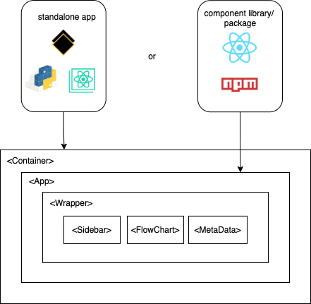
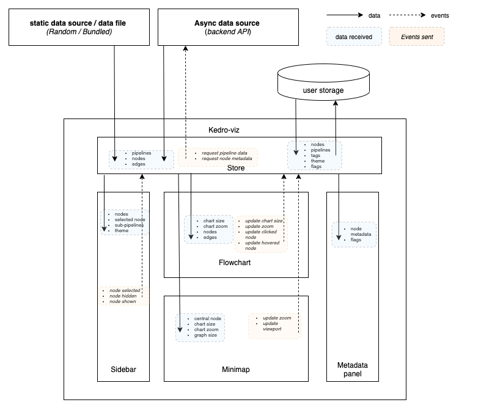

# Architecture

This document describes the high-level architecture of Kedro-Viz. It is your starting point to learn about the codebase.

For further information, see also:

- [Kedro-Viz contributing documentation](CONTRIBUTING.md), which covers how to start development on the project
- [Kedro-Viz style guide](STYLE_GUIDE.md), which walks through our standards and recommended best practices for our codebase
- [Kedro-Viz Architecture Diagram](https://miro.com/app/board/uXjVKhNg1RE=/?moveToWidget=3458764606468376036&cot=10), to see a high level overview of both back-end and front-end and how they are connected.

## High-level Overview

Kedro-Viz is a static [React](https://reactjs.org/) web app that displays an interactive visualisation of a [Kedro](https://kedro.readthedocs.io/en/stable/) pipeline. It was bootstrapped with [Create-React-App](https://create-react-app.dev/). We use [Redux](https://redux.js.org/) to manage the state, and [D3](https://d3js.org/) to render the graph. The production data API is written in Python and exposes data from a Kedro project.

Kedro-Viz can exist either as:

- A standalone web app, which is [published to PyPI](https://pypi.org/project/kedro-viz/) and can be run as a Kedro plugin from the CLI
- A React component, which is [published to npm](https://www.npmjs.com/package/@quantumblack/kedro-viz) and can be imported into a larger React application

To allow the Kedro-Viz web app to be used as a Kedro plugin, first the JavaScript app is compiled into a static dist, then it is bundled with a simple Python server and [published to PyPI](https://pypi.org/project/kedro-viz/).

## Component package/library

Kedro-Viz is built and published as a React component library using Vite (library mode), with the output generated in the /lib directory. The Web Worker used by Kedro-Viz is also pre-bundled during this build so it can run in a separate execution context without requiring any special configuration in consuming applications.

When you import Kedro-Viz from npm, you can pass pipeline data to the component via the `data` prop:

```jsx
<KedroViz
  data={{ nodes: [...], edges: [...], ... }}
  theme="dark" />
```

## Data sources

On initialisation, the app uses a string data token (e.g. 'json' or 'spaceflights') to [determine the data source](CONTRIBUTING.md#data-sources).

You can find example datasets in [/src/utils/data/](/src/utils/data/), which illustrate the basic API structure.

## Bundled data loading

Some data source tokens instruct the app to synchronously `import` [test](/src/utils/data/spaceflights.mock.json)/[demo](/src/utils/data/demo.mock.json) data from bundled JSON files in the `/src/utils/data` directory, or to generate it randomly on page-load. Random data can be seeded with a 'seed' query string in the URL, to allow randomly-generated layouts to be replicated.

## Asynchronous/external data loading

Kedro-Viz loads data asynchronously in production from the API, or when using the 'json' data source identifier in development. The API provides two types of data source: pipeline endpoints and node endpoints.

### Pipeline API endpoints

Each pipeline endpoint corresponds to a different [registered pipeline](https://kedro.readthedocs.io/en/stable/13_resources/02_glossary.html#pipeline) in the Kedro project. Only one registered pipeline should be loaded at a time, so loading data from a pipeline endpoint will reset the pipeline state in the store. Each pipeline dataset contains all the data required to render the graph.

On first page-load, the app always loads the `/api/main` endpoint first. This is the endpoint that corresponds to the 'default' pipeline. The app can load other pipelines from `/api/pipeline/<id>`. If another pipeline is saved as the user's active pipeline in `localStorage`, and if it exists in the current project, then the app will load that pipeline on first page load. However it will always load the `/api/main` endpoint first regardless, in order to check whether the active pipeline is present at that endpoint before requesting it.

### Node API endpoints

Each node endpoint contains data required to populate the metadata panel for that node. When a user selects a node on the graph, if data for this node is not already present, then the app will request additional node data from `/api/nodes/<id>`.

## localStorage

Kedro-Viz uses the browser's `window.localStorage` API to save certain user preferences (such as node/tag/layer/sidebar/label visibility, flags, theme, active pipeline, etc), so that they'll persist from previous user sessions.

The `localStorage` state is updated automatically on every Redux store update, via a subscriber function.

## Data ingestion


Kedro-Viz currently utilizes one method of data ingestion: the Redux setup for the pipeline and flowchart-view related components.

On initialisation for the Redux setup, Kedro-Viz [manually normalises pipeline data](/src/store/normalize-data.js), in order to [make immutable state updates as performant as possible](https://redux.js.org/recipes/structuring-reducers/normalizing-state-shape).

Next, it [initialises the Redux data store](https://github.com/kedro-org/kedro-viz/blob/main/src/store/initial-state.js), by merging this normalised state with other data sources such as saved user preferences from `localStorage`, URL flags, and default values.

During preparation, the initial state is separated into two parts: pipeline and non-pipeline state. This is because the non-pipeline state should persist for the session duration, even if the pipeline state is reset/overwritten - i.e. if the user selects a new top-level pipeline.

## React components

React components are all to be found in `/src/components/`. The top-level React component for the standalone app is `Container`, which includes some extra code (e.g. global styles and data loading) that aren't included in the component library. The entry-point component for the library (as set by the `main` property in package.json) is `App`.



The `App` component contains the [Redux store Provider](https://react-redux.js.org/api/provider), as well as the `Wrapper` component, which provides the outermost HTML parent elements, and the main presentation components such as the `Sidebar`, `FlowChart` and `MetaData` panel, among others.

## State management

The following sections outline the Redux state management used to manage the data and app state for the flowchart view.



Kedro-Viz uses Redux to manage state across the application. For example, the zoom level is synchronised between the MiniMap and FlowChart components by storing the current zoom level and chart dimensions in the central store, and dispatching actions to update this value. These actions first check the origin of the request before dispatching, in order to avoid a circular loop.

## Actions

Redux actions are placed in `/src/actions/`. Where possible, actions are grouped into related files. The `/src/actions/index.js` file contains miscellaneous other actions that didn't fall into any specific group.

## Reducers

Redux reducers are placed in `/src/reducers/`. We use a [combineReducers](https://redux.js.org/api/combinereducers) function to split up our root reducer into child reducers for each corresponding state property. The exception is the `resetDataReducer`, which acts across the entire state when updating to a new pipeline, so it is applied separately in the `rootReducer`.

## Selectors

Selectors can be found in `/src/selectors/`. We use [Reselect](https://github.com/reduxjs/reselect) to derive data from the state and translate it into useful data structures while keeping it memoised in order to prevent repeated calculations when the original values have not changed. In order to avoid circular imports, we've occasionally needed to get creative with file naming, hence the low-level 'disabled' selectors are separated into different files from the rest of the node/edge/tag selectors.

We have used Kedro-Viz to visualize the selector dependency graph - [visit the demo to see it in action](https://demo.kedro.org/?data=selectors).

## Utils

The `/src/utils/` directory contains miscellaneous reusable utility functions.

## Config

We use `/src/config.js` for reusable constants and configuration values, such as flag defaults, sidebar widths, etc. Note that some values in `config.js` are shared with Sass variables in `/src/styles/_variables.scss`, so they must be updated in both places.

## Graph rendering

Kedro-Viz uses D3 to render the pipeline graph (in the `FlowChart` component), and the minimap (in the `MiniMap` component).

The main graph objects are 'nodes' and 'edges'.

A 'node' in Kedro-Viz is different from the concept of a 'node' in Kedro projects. A node on Kedro-Viz refers to a graph element for display on the flowchart, which could be one of three types:

- `task`: a Kedro [node](https://kedro.readthedocs.io/en/stable/13_resources/02_glossary.html#node), i.e. a Python function wrapper
- `data`: a dataset
- `parameter`: reusable config variables

An edge is a link between two Kedro-Viz nodes - that is, the input/output for a Kedro node - and is represented with an arrow.

## Layout calculations

Kedro-Viz includes a graph layout engine, for details see the [layout engine documentation](https://github.com/kedro-org/kedro-viz/blob/main/LAYOUT_ENGINE.md).

Our layout engine runs inside a web worker, which asynchronously performs these expensive calculations in a separate CPU thread, in order to avoid this blocking other operations on the main thread (e.g. CSS transitions and other state updates).

The app uses [redux-watch](https://github.com/ExodusMovement/redux-watch) with a graph input selector to watch the store for state changes relevant to the graph layout. If the layout needs to change, this listener dispatches an asynchronous action which sends a message to the web worker to instruct it to calculate the new layout. Once the layout worker completes its calculations, it returns a new action to update the store's `state.graph` property with the new layout. Updates to the graph input state during worker calculations will interrupt the worker and cause it to start over from scratch.

## Backend Architecture


The backend of Kedro-Viz serves as the data provider and API layer that interacts with Kedro projects and manages data access for visualisations in the frontend. It offers a REST API to support data retrieval for the frontend, allowing access to pipeline structures and node-specific details. The CLI enables users to launch Kedro-Viz from the command line, while deploy and build options enable seamless sharing of pipeline visualisations on any static website hosting platform.

As of the "Modularity of Kedro-Viz" v1 work ([#2265](https://github.com/kedro-org/kedro-viz/issues/2265)), the backend is built around **two paths** that feed the same REST API contract. The diagram above predates this change and shows the original, single-path design (`DataAccessManager` and `Repositories` built from a live-loaded Kedro project); the sections below, and the data-flow diagram further down, describe the current v1 state.

### Inspection path (primary, since v1)

Most requests are served from Kedro's **inspection snapshot** (`kedro.inspection.get_project_snapshot()`) — a serialisable description of a project's pipelines, nodes, datasets and parameters — rather than from a live-loaded `Pipeline`/`DataCatalog`. This is the path behind `/api/main`, `/api/pipelines/{id}` and `/api/run-status`.

- **`VizProjectContext`** (`kedro_viz/integrations/kedro/inspection/context.py`) is the single object that owns one project's inspection snapshot and the services built on it. It is constructed once per project when the server starts, then passed explicitly into `create_project_router(context)` (`kedro_viz/api/rest/router.py`), which binds the graph and run-status routes to it. Routers receive the context as an argument rather than reaching for a process-wide global, so multiple project contexts can coexist in the same process without state leaking between them.
- **`GraphService`** (`kedro_viz/integrations/kedro/inspection/services/graph_service.py`) is reached via `context.graph` and answers `get_pipeline_response(pipeline_id)` for both `/api/main` (no ID; falls back to the default registered pipeline) and `/api/pipelines/{id}`.
- **`GraphBuilder`** (`kedro_viz/integrations/kedro/inspection/builders/graph_builder.py`), together with `builders/layers.py` and `builders/modular_pipelines/*`, turns the snapshot into the same `GraphAPIResponse` shape (nodes, edges, tags, layers, modular pipeline tree, selected pipeline) the frontend already consumes — the REST contract itself did not change.
- **`RunStatusService`** (`kedro_viz/integrations/kedro/inspection/services/run_status_service.py`), reached via `context.run_status`, and `builders/run_status_builder.py` serve `/api/run-status` the same way.
- **`node_ids.py`** keeps the existing node-ID hashing scheme compatible with the pre-v1 IDs, so node identity is stable across both paths (this matters for `/api/nodes/{id}` and run-status lookups, which are still keyed by the live path — see below).
- **`datasource/snapshot_source.py`** loads and normalises the `ProjectSnapshot`; **`datasource/enrichment.py`** layers Viz-specific extras on top of it — file-backed stats, custom node/dataset styles, and layer overrides — that the snapshot itself doesn't carry.

### Live path (legacy, still required for some features)

The pre-v1 backend — `DataAccessManager` and its `Repositories` (`kedro_viz/data_access/`), fed by a live-loaded `KedroSession`/`Pipeline`/`DataCatalog` in `kedro_viz/integrations/kedro/live/`) — has not been removed. It remains the source of truth for the features the inspection snapshot does not cover yet:

- **Node metadata** (`/api/nodes/{id}`) — task source code, dataset previews and run commands, served via `get_node_metadata_response` in `kedro_viz/api/rest/responses/nodes.py`.
- **Static export** (`--save-file`, `kedro viz deploy`) — `save_responses.py` still builds its output via the legacy `get_pipeline_response()` in `kedro_viz/api/rest/responses/pipelines.py`, not `GraphService`.

Because these are the minority of requests, the live project load for them is deferred rather than paid upfront: **`DeferredDataLoader`** (`kedro_viz/integrations/kedro/live/deferred_loader.py`) runs the live load once, on first use, so a session that never asks for node metadata or a static export never pays for booting a live `KedroSession` at all. A failed load is not retried; every subsequent call raises `DeferredDataLoadError` with a stable, user-facing message instead of repeating an already-failed (and potentially expensive) load.

### Remaining legacy consumers

Two consumers bypass the REST API entirely and call the live path's Python functions directly, rather than going through `VizProjectContext`:

- **NotebookVisualizer** (`kedro_viz/integrations/notebook/data_loader.py`) calls `populate_data`/`DataAccessManager` directly to render a pipeline passed in-memory from a notebook.
- **VSCode extension**, via `get_kedro_project_json_data` in `pipelines.py`, which also calls the legacy `get_pipeline_response()`.

### Backend data flow


```mermaid
flowchart TB
    subgraph Kedro["Kedro"]
        Snapshot["ProjectSnapshot<br/>metadata, pipelines, nodes,<br/>datasets, parameters"]
        Session["KedroSession / Pipeline / DataCatalog"]
    end

    subgraph Inspection["Inspection path (primary)"]
        Context["VizProjectContext"]
        GraphSvc["GraphService + GraphBuilder"]
        RunSvc["RunStatusService"]
        NewAPI["/api/main<br/>/api/pipelines/&#123;id&#125;<br/>/api/run-status"]
    end

    subgraph Live["Live path (legacy, deferred)"]
        Deferred["DeferredDataLoader<br/>loads on first use only"]
        Manager["DataAccessManager<br/>+ Repositories"]
        LegacyConsumers["/api/nodes/&#123;id&#125;<br/>--save-file / deploy<br/>NotebookVisualizer, VSCode"]
    end

    UI["React UI / frontend consumers"]

    Snapshot --> Context
    Context --> GraphSvc
    Context --> RunSvc
    GraphSvc --> NewAPI
    RunSvc --> NewAPI
    NewAPI --> UI

    Session --> Deferred
    LegacyConsumers --> Deferred
    Deferred --> Manager
    Manager --> LegacyConsumers
    LegacyConsumers --> UI
```

### What's next

This dual-path design is an intentional checkpoint for v1, not the final architecture. Follow-up work is tracked in:

- [#2723](https://github.com/kedro-org/kedro-viz/issues/2723) — serve task source metadata from the inspection snapshot, so `/api/nodes/{id}` no longer needs the live path.
- [#2757](https://github.com/kedro-org/kedro-viz/issues/2757) — migrate NotebookVisualizer and VSCode off live objects and onto the inspection snapshot.
- [#2724](https://github.com/kedro-org/kedro-viz/issues/2724) — remove the legacy graph-building backend (`DataAccessManager`, its `Repositories`, and the legacy `get_pipeline_response()`) once nothing depends on it.
- [#2688](https://github.com/kedro-org/kedro-viz/issues/2688) — remove the flowchart Pydantic models that depend on live Kedro objects, once #2724 lands.

Until those land, expect both paths to keep coexisting: the inspection path for the main graph and run status, and the live path — deferred, but still fully present — for node metadata, static export, and the notebook/VSCode integrations.
