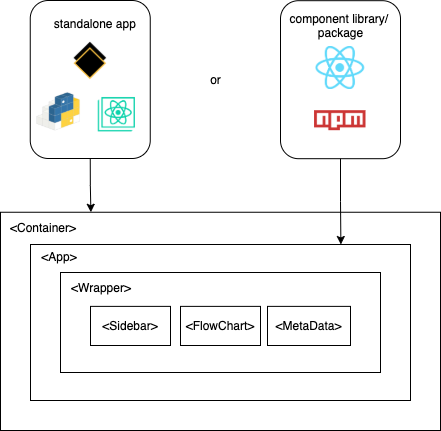
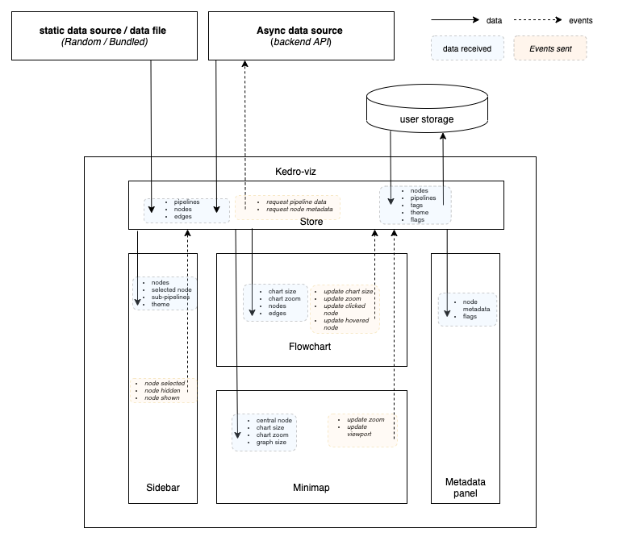

# Architecture

This document describes the high-level architecture of Kedro-Viz. It is your starting point to learn about the codebase.

For further information, see also:

- [Kedro-Viz contributing documentation](CONTRIBUTING.md), which covers how to start development on the project
- [Kedro-Viz style guide](STYLE_GUIDE.md), which walks through our standards and recommended best practices for our codebase
- [Kedro-Viz Architecture Diagram](https://miro.com/app/board/uXjVKhNg1RE=/?moveToWidget=3458764685599765471&cot=14), to see a high level overview of both back-end and front-end and how they are connected.

## High-level Overview

Kedro-Viz is a static [React](https://reactjs.org/) web app that displays an interactive visualisation of a [Kedro](https://kedro.readthedocs.io/en/stable/) pipeline. It was bootstrapped with [Create-React-App](https://create-react-app.dev/). We use [Redux](https://redux.js.org/) to manage the state, and [D3](https://d3js.org/) to render the graph. The production data API is written in Python and exposes data from a Kedro project.

Kedro-Viz can exist either as:

- A standalone web app, which is [published to PyPI](https://pypi.org/project/kedro-viz/) and can be run as a Kedro plugin from the CLI
- A React component, which is [published to npm](https://www.npmjs.com/package/@quantumblack/kedro-viz) and can be imported into a larger React application

To allow the Kedro-Viz web app to be used as a Kedro plugin, first the JavaScript app is compiled into a static dist, then it is bundled with a simple Python server and [published to PyPI](https://pypi.org/project/kedro-viz/).

## Component package/library

Kedro-Viz is built and published as a React component library using Vite (library mode), with the output generated in the /lib directory. The Web Worker used by Kedro-Viz is also pre-bundled during this build so it can run in a separate execution context without requiring any special configuration in consuming applications.

When you import Kedro-Viz from npm, you can pass pipeline data to the component via the `data` prop:

```jsx
<KedroViz
  data={{ nodes: [...], edges: [...], ... }}
  theme="dark" />
```

## Data sources

On initialisation, the app uses a string data token (e.g. 'json' or 'spaceflights') to [determine the data source](CONTRIBUTING.md#data-sources).

You can find example datasets in [/src/utils/data/](/src/utils/data/), which illustrate the basic API structure.

## Bundled data loading

Some data source tokens instruct the app to synchronously `import` [test](/src/utils/data/spaceflights.mock.json)/[demo](/src/utils/data/demo.mock.json) data from bundled JSON files in the `/src/utils/data` directory, or to generate it randomly on page-load. Random data can be seeded with a 'seed' query string in the URL, to allow randomly-generated layouts to be replicated.

## Asynchronous/external data loading

Kedro-Viz loads data asynchronously in production from the API, or when using the 'json' data source identifier in development. The API provides two types of data source: pipeline endpoints and node endpoints.

### Pipeline API endpoints

Each pipeline endpoint corresponds to a different [registered pipeline](https://kedro.readthedocs.io/en/stable/13_resources/02_glossary.html#pipeline) in the Kedro project. Only one registered pipeline should be loaded at a time, so loading data from a pipeline endpoint will reset the pipeline state in the store. Each pipeline dataset contains all the data required to render the graph.

On first page-load, the app always loads the `/api/main` endpoint first. This is the endpoint that corresponds to the 'default' pipeline. The app can load other pipelines from `/api/pipeline/<id>`. If another pipeline is saved as the user's active pipeline in `localStorage`, and if it exists in the current project, then the app will load that pipeline on first page load. However it will always load the `/api/main` endpoint first regardless, in order to check whether the active pipeline is present at that endpoint before requesting it.

### Node API endpoints

Each node endpoint contains data required to populate the metadata panel for that node. When a user selects a node on the graph, if data for this node is not already present, then the app will request additional node data from `/api/nodes/<id>`.

## localStorage

Kedro-Viz uses the browser's `window.localStorage` API to save certain user preferences (such as node/tag/layer/sidebar/label visibility, flags, theme, active pipeline, etc), so that they'll persist from previous user sessions.

The `localStorage` state is updated automatically on every Redux store update, via a subscriber function.

## Data ingestion


Kedro-Viz currently utilizes one method of data ingestion: the Redux setup for the pipeline and flowchart-view related components.

On initialisation for the Redux setup, Kedro-Viz [manually normalises pipeline data](/src/store/normalize-data.js), in order to [make immutable state updates as performant as possible](https://redux.js.org/recipes/structuring-reducers/normalizing-state-shape).

Next, it [initialises the Redux data store](https://github.com/kedro-org/kedro-viz/blob/main/src/store/initial-state.js), by merging this normalised state with other data sources such as saved user preferences from `localStorage`, URL flags, and default values.

During preparation, the initial state is separated into two parts: pipeline and non-pipeline state. This is because the non-pipeline state should persist for the session duration, even if the pipeline state is reset/overwritten - i.e. if the user selects a new top-level pipeline.

## React components

React components are all to be found in `/src/components/`. The top-level React component for the standalone app is `Container`, which includes some extra code (e.g. global styles and data loading) that aren't included in the component library. The entry-point component for the library (as set by the `main` property in package.json) is `App`.



The `App` component contains the [Redux store Provider](https://react-redux.js.org/api/provider), as well as the `Wrapper` component, which provides the outermost HTML parent elements, and the main presentation components such as the `Sidebar`, `FlowChart` and `MetaData` panel, among others.

## State management

The following sections outline the Redux state management used to manage the data and app state for the flowchart view.



Kedro-Viz uses Redux to manage state across the application. For example, the zoom level is synchronised between the MiniMap and FlowChart components by storing the current zoom level and chart dimensions in the central store, and dispatching actions to update this value. These actions first check the origin of the request before dispatching, in order to avoid a circular loop.

## Actions

Redux actions are placed in `/src/actions/`. Where possible, actions are grouped into related files. The `/src/actions/index.js` file contains miscellaneous other actions that didn't fall into any specific group.

## Reducers

Redux reducers are placed in `/src/reducers/`. We use a [combineReducers](https://redux.js.org/api/combinereducers) function to split up our root reducer into child reducers for each corresponding state property. The exception is the `resetDataReducer`, which acts across the entire state when updating to a new pipeline, so it is applied separately in the `rootReducer`.

## Selectors

Selectors can be found in `/src/selectors/`. We use [Reselect](https://github.com/reduxjs/reselect) to derive data from the state and translate it into useful data structures while keeping it memoised in order to prevent repeated calculations when the original values have not changed. In order to avoid circular imports, we've occasionally needed to get creative with file naming, hence the low-level 'disabled' selectors are separated into different files from the rest of the node/edge/tag selectors.

We have used Kedro-Viz to visualize the selector dependency graph - [visit the demo to see it in action](https://demo.kedro.org/?data=selectors).

## Utils

The `/src/utils/` directory contains miscellaneous reusable utility functions.

## Config

We use `/src/config.js` for reusable constants and configuration values, such as flag defaults, sidebar widths, etc. Note that some values in `config.js` are shared with Sass variables in `/src/styles/_variables.scss`, so they must be updated in both places.

## Graph rendering

Kedro-Viz uses D3 to render the pipeline graph (in the `FlowChart` component), and the minimap (in the `MiniMap` component).

The main graph objects are 'nodes' and 'edges'.

A 'node' in Kedro-Viz is different from the concept of a 'node' in Kedro projects. A node on Kedro-Viz refers to a graph element for display on the flowchart, which could be one of three types:

- `task`: a Kedro [node](https://kedro.readthedocs.io/en/stable/13_resources/02_glossary.html#node), i.e. a Python function wrapper
- `data`: a dataset
- `parameter`: reusable config variables

An edge is a link between two Kedro-Viz nodes - that is, the input/output for a Kedro node - and is represented with an arrow.

## Layout calculations

Kedro-Viz includes a graph layout engine, for details see the [layout engine documentation](https://github.com/kedro-org/kedro-viz/blob/main/LAYOUT_ENGINE.md).

Our layout engine runs inside a web worker, which asynchronously performs these expensive calculations in a separate CPU thread, in order to avoid this blocking other operations on the main thread (e.g. CSS transitions and other state updates).

The app uses [redux-watch](https://github.com/ExodusMovement/redux-watch) with a graph input selector to watch the store for state changes relevant to the graph layout. If the layout needs to change, this listener dispatches an asynchronous action which sends a message to the web worker to instruct it to calculate the new layout. Once the layout worker completes its calculations, it returns a new action to update the store's `state.graph` property with the new layout. Updates to the graph input state during worker calculations will interrupt the worker and cause it to start over from scratch.

## Backend Architecture


The backend of Kedro-Viz is the data provider and API layer that interacts with Kedro projects and manages data access for visualisations in the frontend. It offers a REST API to support data retrieval for the frontend, giving access to pipeline structures and details about individual nodes. The CLI enables users to launch Kedro-Viz from the command line. Deploy and build options enable sharing of pipeline visualisations on any static website hosting platform.

The backend answers its REST API from two paths, one for reading a project as data and one for reading a project as a running system. Both paths return the same response shapes, so the frontend and the rest of the API surface do not need to know which path answered a given request.

### Inspection path

The inspection path treats a project as data. Kedro produces a snapshot of a project: a serialisable structure covering its pipelines, nodes, datasets, and parameters. The backend builds its graph, layers, and modular pipeline tree from that snapshot, the resolved configuration, and extras loaded from files such as dataset statistics. It does this without holding a live pipeline or catalog in memory. This is the primary path, and it answers most requests: `/api/main`, `/api/pipelines/{id}`, and `/api/run-status`. Run status is served from this same path, but not from the snapshot: it comes from a run events file that hooks record while a pipeline runs.

Each project served this way owns a context: an object that holds the snapshot together with the graph and run status services built on it. The server creates this context a single time per project at startup. Passing this context explicitly, rather than reading it from shared global state, keeps those services isolated. More than one project can be served from the same process without state from one leaking into another. Node metadata and static export, described in the live path below, do not yet share this isolation. They still read from state the process sets up a single time and shares across every project.

Lite mode is a variant of this same path, for projects with dependencies that cannot be imported in the current environment. Rather than requiring every dependency to be installed before a project can be visualised, lite mode mocks the missing ones and still builds a snapshot.

Statistics, custom styles, and layer overrides are not part of the snapshot itself. They are layered on top of it as a separate enrichment step, keeping the description Kedro produces distinct from the presentation choices Kedro-Viz adds to it.

Node identity is kept stable across both paths, so a node built from the snapshot and a node built from a live project resolve to the same ID. This lets the frontend treat a node consistently even when its metadata is fetched from the other path, described below.

### Live path

Kedro can also be loaded as a running system: a session, a pipeline, and a catalog, held in memory the way they exist when a project runs. The live path uses this route, and is the source of truth for the handful of features that need something the snapshot does not carry. That includes the source code and run commands behind node metadata, dataset previews, and the static output produced for `--save-file`, deploying from the running UI, and `kedro viz build`/`kedro viz deploy`.

Because most requests are answered by the inspection path, loading a live project inside the running server is deferred until a request actually needs one. Node metadata, `--save-file`, and deploying from within the running UI all wait until first use this way. A project that never asks for any of them never pays the cost of loading a live project. If a load fails, later requests are told about that same failure rather than retrying a load expected to fail again.

One exception: when hooks are enabled, the backend loads the live catalog and pipelines at startup anyway, to capture any layers a hook modifies. The later step, building the repositories from that catalog, still waits until something needs them.

`kedro viz build` and `kedro viz deploy`, run from the command line, reach that same live state a different way. Each runs in a process of its own, spun up for that single command, and loads the project directly, rather than waiting on the deferred load of the running server. A notebook integration and the VSCode extension work the same way: each loads a project directly in its own process to render a pipeline without the REST API.

### Backend data flow


```mermaid
flowchart TB
    subgraph Kedro["Kedro"]
        Snapshot["ProjectSnapshot<br/>metadata, pipelines, nodes,<br/>datasets, parameters"]
        RunEvents["run events file<br/>recorded by hooks"]
        Session["KedroSession / Pipeline / DataCatalog"]
    end

    subgraph Inspection["Inspection path"]
        Context["VizProjectContext"]
        GraphSvc["GraphService + GraphBuilder"]
        RunSvc["RunStatusService"]
        NewAPI["/api/main<br/>/api/pipelines/&#123;id&#125;<br/>/api/run-status"]
    end

    subgraph Live["Live path"]
        Deferred["DeferredDataLoader<br/>loads on first use, in this process"]
        Manager["DataAccessManager<br/>+ Repositories"]
        DeferredConsumers["/api/nodes/&#123;id&#125;<br/>--save-file / deploy from the UI"]
        DirectConsumers["kedro viz build / deploy<br/>NotebookVisualizer, VSCode"]
    end

    UI["React UI / frontend consumers"]

    Snapshot --> Context
    Context --> GraphSvc
    Context --> RunSvc
    RunEvents --> RunSvc
    GraphSvc --> NewAPI
    RunSvc --> NewAPI
    NewAPI --> UI

    Session --> Deferred
    DeferredConsumers --> Deferred
    Deferred --> Manager
    Manager --> DeferredConsumers
    DeferredConsumers --> UI

    DirectConsumers -- "own process, loads directly" --> Manager
```
