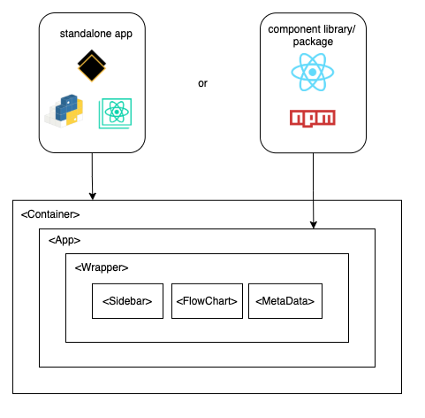
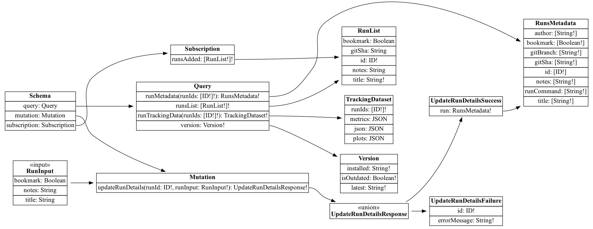

# Architecture

This document describes the high-level architecture of Kedro-Viz. It is your starting point to learn about the codebase.

For further information, see also:

- [Kedro-Viz contributing documentation](CONTRIBUTING.md), which covers how to start development on the project
- [Kedro-Viz style guide](STYLE_GUIDE.md), which walks through our standards and recommended best practices for our codebase

## High-level Overview

Kedro-Viz is a static [React](https://reactjs.org/) web app that displays an interactive visualisation of a [Kedro](https://kedro.readthedocs.io/en/stable/) pipeline. It was bootstrapped with [Create-React-App](https://create-react-app.dev/). We use [Redux](https://redux.js.org/) to manage the state, and [D3](https://d3js.org/) to render the graph. The production data API is written in Python and exposes data from a Kedro project.

Kedro-Viz can exist either as:

- A standalone web app, which is [published to PyPI](https://pypi.org/project/kedro-viz/) and can be run as a Kedro plugin from the CLI
- A React component, which is [published to npm](https://www.npmjs.com/package/@quantumblack/kedro-viz) and can be imported into a larger React application

To allow the Kedro-Viz web app to be used as a Kedro plugin, first the JavaScript app is compiled into a static build, then it is bundled with a simple Python server and [published to PyPI](https://pypi.org/project/kedro-viz/).

## Component package/library

To publish Kedro-Viz as a React component library, it is first transpiled to the `/lib` directory with Babel. This process requires that the web worker be fully compiled (including its dependencies) with webpack, as it exists in a separate context requiring custom webpack loaders, which cannot be relied upon in an external parent application.

When you import Kedro-Viz from npm, you can pass pipeline data to the component via the `data` prop:

```jsx
<KedroViz
  data={{ nodes: [...], edges: [...], ... }}
  theme="dark" />
```

## Data sources

On initialisation, the app uses a string data token (e.g. 'json' or 'spaceflights') to [determine the data source](CONTRIBUTING.md#data-sources).

You can find example datasets in [/src/utils/data/](/src/utils/data/), which illustrate the basic API structure.

## Bundled data loading

Some data source tokens instruct the app to synchronously `import` [test](/src/utils/data/spaceflights.mock.json)/[demo](/src/utils/data/demo.mock.json) data from bundled JSON files in the `/src/utils/data` directory, or to generate it randomly on page-load. Random data can be seeded with a 'seed' query string in the URL, to allow randomly-generated layouts to be replicated.

## Asynchronous/external data loading

Kedro-Viz loads data asynchronously in production from the API, or when using the 'json' data source identifier in development. The API provides two types of data source: pipeline endpoints and node endpoints.

### Pipeline API endpoints

Each pipeline endpoint corresponds to a different [registered pipeline](https://kedro.readthedocs.io/en/stable/13_resources/02_glossary.html#pipeline) in the Kedro project. Only one registered pipeline should be loaded at a time, so loading data from a pipeline endpoint will reset the pipeline state in the store. Each pipeline dataset contains all the data required to render the graph.

On first page-load, the app always loads the `/api/main` endpoint first. This is the endpoint that corresponds to the 'default' pipeline. The app can load other pipelines from `/api/pipeline/<id>`. If another pipeline is saved as the user's active pipeline in `localStorage`, and if it exists in the current project, then the app will load that pipeline on first page load. However it will always load the `/api/main` endpoint first regardless, in order to check whether the active pipeline is present at that endpoint before requesting it.

### Node API endpoints

Each node endpoint contains data required to populate the metadata panel for that node. When a user selects a node on the graph, if data for this node is not already present, then the app will request additional node data from `/api/nodes/<id>`.

## localStorage

Kedro-Viz uses the browser's `window.localStorage` API to save certain user preferences (such as node/tag/layer/sidebar/label visibility, flags, theme, active pipeline, etc), so that they'll persist from previous user sessions.

The `localStorage` state is updated automatically on every Redux store update, via a subscriber function.

## Data ingestion


Kedro-Viz currently utilizes two different methods of data ingestion: the Redux setup for the pipeline and flowchart-view related components, and GraphQL via Apollo Client for the experiment tracking components. 

On initialisation for the Redux setup, Kedro-Viz [manually normalises pipeline data](/src/store/normalize-data.js), in order to [make immutable state updates as performant as possible](https://redux.js.org/recipes/structuring-reducers/normalizing-state-shape).

Next, it [initialises the Redux data store](https://github.com/kedro-org/kedro-viz/blob/main/src/store/initial-state.js), by merging this normalised state with other data sources such as saved user preferences from `localStorage`, URL flags, and default values.

During preparation, the initial state is separated into two parts: pipeline and non-pipeline state. This is because the non-pipeline state should persist for the session duration, even if the pipeline state is reset/overwritten - i.e. if the user selects a new top-level pipeline.

Kedro run data used for experiment tracking are stored in a SQLite database that is generated automatically once [experiment tracking is enabled in your Kedro project](https://kedro.readthedocs.io/en/stable/08_logging/02_experiment_tracking.html). By default, the session store database sits under the `/data` directory of your Kedro project as `session_store.db`. On loading Kedro-Viz from the Kedro project, the Kedro-Viz backend will consume the run data stored in the database and serve the data via the GraphQL endpoint via GraphQL query requests from the Apollo client on the front end. 

The server also allows updates to the database for certain fields of the run data (name, notes, etc.) via mutations, while subscriptions enabled by ASGI WebSocket allow real-time updates of run data. 

## React components

React components are all to be found in `/src/components/`. The top-level React component for the standalone app is `Container`, which includes some extra code (e.g. global styles and data loading) that aren't included in the component library. The entry-point component for the library (as set by the `main` property in package.json) is `App`.



The `App` component contains the [Redux store Provider](https://react-redux.js.org/api/provider), as well as the `Wrapper` component, which provides the outermost HTML parent elements, and the main presentation components such as the `Sidebar`, `FlowChart` and `MetaData` panel, among others.

## State management

The following sections outline the Redux state management used to manage the data and app state for the flowchart view. The data for the runs view (experiment tracking features) are managed by React hooks and the Apollo GraphQL client. 


Kedro-Viz uses Redux to manage state across the application. For example, the zoom level is synchronised between the MiniMap and FlowChart components by storing the current zoom level and chart dimensions in the central store, and dispatching actions to update this value. These actions first check the origin of the request before dispatching, in order to avoid a circular loop.

## Actions

Redux actions are placed in `/src/actions/`. Where possible, actions are grouped into related files. The `/src/actions/index.js` file contains miscellaneous other actions that didn't fall into any specific group.

## Reducers

Redux reducers are placed in `/src/reducers/`. We use a [combineReducers](https://redux.js.org/api/combinereducers) function to split up our root reducer into child reducers for each corresponding state property. The exception is the `resetDataReducer`, which acts across the entire state when updating to a new pipeline, so it is applied separately in the `rootReducer`.

## Selectors

Selectors can be found in `/src/selectors/`. We use [Reselect](https://github.com/reduxjs/reselect) to derive data from the state and translate it into useful data structures while keeping it memoised in order to prevent repeated calculations when the original values have not changed. In order to avoid circular imports, we've occasionally needed to get creative with file naming, hence the low-level 'disabled' selectors are separated into different files from the rest of the node/edge/tag selectors.

We have used Kedro-Viz to visualize the selector dependency graph - [visit the demo to see it in action](https://demo.kedro.org/?data=selectors).

## Apollo

The `src/apollo` directory contains all the related setup for ingesting data from the GraphQL endpoint for the experiment tracking features. This includes the schema that defines all query, mutation, and subscription types, the config that sets up the Apollo Client to be used within React components, and other files containing helper functions, such as mocks to generate random data for the mock server. 

The GraphQL schema is defined on the backend by Strawberry and automatically converted to GraphQL SDL (schema definition language) with `make schema-fix`. A CI check ensures that the resulting `schema.graphql` and below visualization are always in sync with the backend definition.



You can see documentation for the schema and run mock queries using GraphiQL, the GraphQL integrated development environment. This is possible without launching the full backend server: run `make strawberry-server` and then go to [http://127.0.0.1:8000/graphql](http://127.0.0.1:8000/graphql).

⚠️ When a query supplies an ordered argument, the backend response must maintain the same ordering. For example, a the response to a query that calls for `runIds = [2, 3, 1]` should respond with runs in that same order. 

## Utils

The `/src/utils/` directory contains miscellaneous reusable utility functions.

## Config

We use `/src/config.js` for reusable constants and configuration values, such as flag defaults, sidebar widths, etc. Note that some values in `config.js` are shared with Sass variables in `/src/styles/_variables.scss`, so they must be updated in both places.

## Graph rendering

Kedro-Viz uses D3 to render the pipeline graph (in the `FlowChart` component), and the minimap (in the `MiniMap` component).

The main graph objects are 'nodes' and 'edges'.

A 'node' in Kedro-Viz is different from the concept of a 'node' in Kedro projects. A node on Kedro-Viz refers to a graph element for display on the flowchart, which could be one of three types:

- `task`: a Kedro [node](https://kedro.readthedocs.io/en/stable/13_resources/02_glossary.html#node), i.e. a Python function wrapper
- `data`: a dataset
- `parameter`: reusable config variables

An edge is a link between two Kedro-Viz nodes - that is, the input/output for a Kedro node - and is represented with an arrow.

## Layout calculations

Kedro-Viz includes a graph layout engine, for details see the [layout engine documentation](https://github.com/kedro-org/kedro-viz/blob/main/LAYOUT_ENGINE.md).

Our layout engine runs inside a web worker, which asynchronously performs these expensive calculations in a separate CPU thread, in order to avoid this blocking other operations on the main thread (e.g. CSS transitions and other state updates).

The app uses [redux-watch](https://github.com/ExodusMovement/redux-watch) with a graph input selector to watch the store for state changes relevant to the graph layout. If the layout needs to change, this listener dispatches an asynchronous action which sends a message to the web worker to instruct it to calculate the new layout. Once the layout worker completes its calculations, it returns a new action to update the store's `state.graph` property with the new layout. Updates to the graph input state during worker calculations will interrupt the worker and cause it to start over from scratch.
