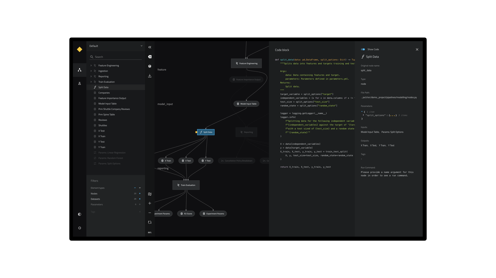

# Kedro-Viz

<br />
<p align="center">



</p>

<p align="center">
✨ <em> Data Science Pipelines. Beautifully Designed</em> ✨
<br />
Live Demo: <a href="https://quantumblacklabs.github.io/kedro-viz/" target="_blank">https://quantumblacklabs.github.io/kedro-viz/</a>
</p>

<br />

[](https://circleci.com/gh/quantumblacklabs/kedro-viz/tree/main)
[](https://badge.fury.io/js/%40quantumblack%2Fkedro-viz)
[](https://pypi.org/project/kedro-viz/)
[](https://pypi.org/project/kedro-viz/)
[](https://opensource.org/licenses/Apache-2.0)
[](https://doi.org/10.5281/zenodo.4355948)
[](https://github.com/prettier/prettier)

## Introduction

Kedro-Viz is an interactive development tool for building data science pipelines with [Kedro](https://github.com/quantumblacklabs/kedro).

## Features

- ✨ Complete visualisation of a Kedro project and its pipelines
- 🎨 Supports light & dark themes out of the box
- 🚀 Scales to big pipelines with hundreds of nodes
- 🔎 Highly interactive, filterable and searchable
- 🔬 Focus mode for modular pipeline visualisation
- 📊 Rich metadata side panel to display parameters, plots, etc.
- ♻️ Autoreload on code change
- 🎩 Many more to come

## Installation

There are two ways you can use Kedro-Viz:

* As a [Kedro plugin](https://kedro.readthedocs.io/en/stable/07_extend_kedro/04_plugins.html) (the most common way).

    To install Kedro-Viz as a Kedro plugin:

    ```bash
    pip install kedro-viz
    ```

* As a standalone React component (for embedding Kedro-Viz in your web application).

   To install the standalone React component:

    ```bash
    npm install @quantumblack/kedro-viz
    ```

## Usage

### As a Kedro plugin

To launch Kedro-Viz from the command line as a Kedro plugin, use the following command from the root folder of your Kedro project:

```bash
kedro viz
```

A browser tab opens automatically to serve the visualisation at `http://127.0.0.1:4141/`.

Kedro-Viz also supports the following additional arguments on the command line:

```bash
Usage: kedro viz [OPTIONS]

  Visualise a Kedro pipeline using Kedro-Viz.

Options:
  --host TEXT               Host that viz will listen to. Defaults to
                            localhost.

  --port INTEGER            TCP port that viz will listen to. Defaults to
                            4141.

  --browser / --no-browser  Whether to open viz interface in the default
                            browser or not. Browser will only be opened if
                            host is localhost. Defaults to True.

  --load-file FILE          Path to load the pipeline JSON file
  --save-file FILE          Path to save the pipeline JSON file
  --pipeline TEXT           Name of the registered pipeline to visualise. If not
                            set, the default pipeline is visualised

  -e, --env TEXT            Kedro configuration environment. If not specified,
                            catalog config in `local` will be used

  --autoreload              Autoreload viz server when a Python or YAML file change in
                            the Kedro project

  -h, --help                Show this message and exit.
```

### As a standalone React component

To use Kedro-Viz as a standalone React component, import the component and supply a data JSON as prop:

```javascript
import KedroViz from '@quantumblack/kedro-viz';

const MyApp = () => <KedroViz data={json} />;
```

The JSON can be obtained by running:

```bash
kedro viz --save-file=filename.json
```

## Feature Flags

Kedro-Viz uses features flags to roll out some experimental features. The following flags are currently in use:

| Flag | Description |
|------| ------------|
| sizewarning | From release v3.9.1. Show a warning before rendering very large graphs (default `true`) |

To enable or disable a flag, click on the settings icon in the toolbar and toggle the flag on/off.

Kedro-Viz also logs a message in your browser's [developer console](https://developer.mozilla.org/en-US/docs/Learn/Common_questions/What_are_browser_developer_tools#The_JavaScript_console) to show the available flags and their values as currently set on your machine.

## Maintainers

Kedro-Viz is maintained by the [product team from QuantumBlack](https://kedro.readthedocs.io/en/stable/12_faq/01_faq.html#who-maintains-kedro) and a number of [contributors from across the world](https://github.com/quantumblacklabs/Kedro-Viz/contributors).

## Contribution

If you want to contribute to Kedro-Viz, please check out our [contributing guide](./CONTRIBUTING.md).

## License

Kedro-Viz is licensed under the [Apache 2.0](https://github.com/quantumblacklabs/kedro-viz/blob/main/LICENSE.md) License.

## Citation

If you're an academic, Kedro-Viz can also help you, for example, as a tool to visualise how your publication's pipeline is structured. Find our citation reference on [Zenodo](https://doi.org/10.5281/zenodo.4277218).
