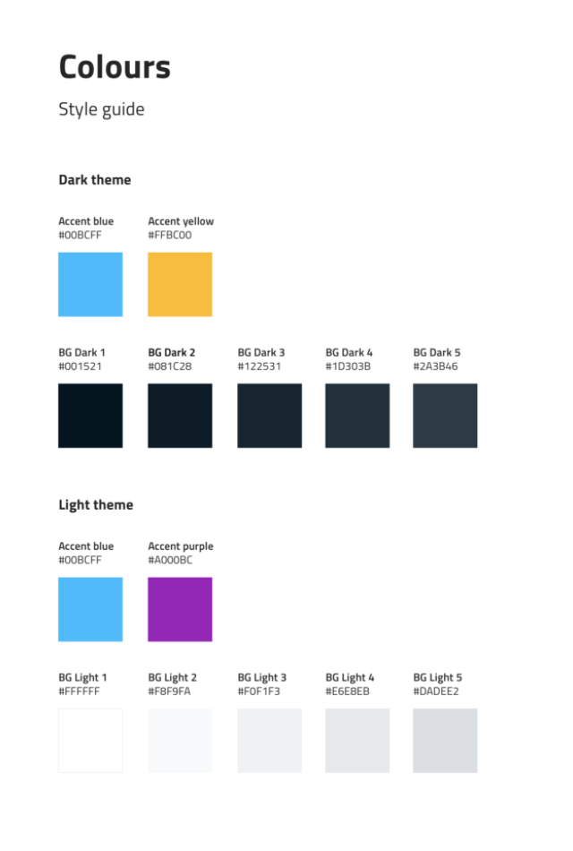

# Front-end style guide

Before you contribute front-end development effort to Kedro-Viz, here are our recommendations for code style, quirks, and best practices.

## Code style and linting

We use [Prettier](https://prettier.io/), [ESLint](https://eslint.org/), and [stylelint](https://stylelint.io/) to lint our SCSS and JavaScript. For the most part, we use the default config - you can find specific details in the `.prettierrc`, `.eslintrc.json`, and `.stylelintrc` config files. We recommend that you install the Prettier, ESLint, and stylelint plugins for your text editor, and enable automatic formatting on save.

Other than that, we mostly recommend following the [AirBnB JavaScript Style Guide](https://github.com/airbnb/javascript).

## Browser and device support

We aim to support recent versions of major modern browsers - i.e. Chome, Firefox, Edge, Safari, and Opera, on both MacOS and Windows. Keeping progressive enhancement in mind, we aim for decent mobile support where possible, i.e. nothing should be broken on mobile, but it's okay for mobile/older browsers to have a slightly degraded experience.

## Kedro UI

Kedro-Viz uses [Kedro-UI](https://quantumblacklabs.github.io/kedro-ui/), our UI component library, for generic/reusable interface components like buttons, modals, dropdowns, etc. 
Kedro-UI is a legacy repo and will no longer be maintained. Hence, we recommend not using Kedro-UI for newer components.  

## Accessibility

We aim to meet [WCAG 2.1 Level AA](https://www.w3.org/WAI/standards-guidelines/wcag/) standards where possible, while acknowledging that this is a data visualization tool, so some criteria will be difficult to pass.

Kedro-Viz should be navigable with different input devices (e.g. mouse, keyboard, and touchscreen), with obvious and visible focus states on all interactive elements. Text elements should have sufficient colour contrast and font-size to ensure readability to a minimum Level AA standard. Use [WAI-ARIA](https://www.w3.org/WAI/standards-guidelines/aria/) features where applicable to improve screenreader support.

We recommend checking [axe](https://www.deque.com/axe/) and [Lighthouse](https://developers.google.com/web/tools/lighthouse) to review for potential accessibility errors if unsure.

## Semantic HTML

Ensure that page content is marked up with [semantic HTML elements](https://html.com/semantic-markup/) to keep it as usable and accessible as possible.

Avoid:

```jsx
<div className="form">
  <div>Contact us</div>
  <div>Use this form to send us a message.</div>
  <div>Email address:</div>
  <input type="text" />
  <div onClick={handleSubmit}>Submit</div>
</div>
```

Prefer:

```jsx
<form onSubmit={handleSubmit}>
  <h1>Contact us</h1>
  <p>Use this form to send us a message.</p>
  <label htmlFor="email">Email address:</label>
  <input id="email" type="email" />
  <button>Submit</button>
</form>
```

## CSS

### Class names

While CSS files are split up per-component and imported via JS, all CSS is still global in scope. Hence, this project uses the [BEM naming convention](http://getbem.com/), to avoid conflicts, reduce rule specificity, and make classes easier to read and understand. To impove CSS maintainability we [reduce rule specificity](https://css-tricks.com/strategies-keeping-css-specificity-low/) and avoid nesting CSS selectors.

Because Kedro-Viz can be imported into other applications, we avoid ever setting global styles. We use the `pipeline-` prefix for most HTML/CSS classes, to reduce the risk of clashes in the global namespace when this project is imported into other applications. It's important never to use global element selectors or generic classes like `.header`.

In general, we try to avoid splitting up blocks and elements in our class names, in order make the full class-name easier to search. However in general, splitting modifiers is okay.

Avoid:

```scss
.pipeline-nodelist {
  &__list {
    @extend %nolist;

    &--nested {
      margin: 0 0 1.2em;
    }
  }
}
```

Prefer:

```scss
.pipeline-nodelist__list {
  @extend %nolist;

  &--nested {
    margin: 0 0 1.2em;
  }
}
```

### Typography

Typography styles are set using the `.kedro` class. It should wrap all text elements, in order to enforce a consistent font-size/font-family etc, allowing the font-sizes to be set relatively using `em` but keeping them independent of parent app font styles. This class is [inherited from Kedro-UI](https://github.com/quantumblacklabs/kedro-ui/blob/master/src/styles/typography/styles.css), where it's used to establish a base of 10px allowing all other `em` based units to equal the equivalent in pixels divided by ten.

### Units

In general, we try to use `em` for styles that depend on font-size (e.g. text margins), `%` for relative layout positioning, and `px` for absolute layout positioning. Avoid using `rem` or viewport units (e.g. `vh`/`vw`/`vmin`/`vmax`) in code that's included in the package library, as these can cause side-effects if the parent app modifies the base font-size or the app is not full-screen.

### Variables

We use Sass variables to declare colours and reuse values wherever useful. It's not necessary to declare every CSS unit value as a variable, but if a value is used in multiple places (for related reasons), then it makes sense to make it a variable - either locally in the component, or application-wide in `src/styles/_variables.scss`. Using a named variable instead of a number clarifies intent, and helps avoid updates to the value in multiple places later on.

Avoid:

```scss
color: #001521;
color: rgba(#001521, 0.5);
color: rgba(0, 0, 0, 0.5);
```

Prefer:

```scss
color: $color-bg-dark-1;
color: rgba($color-bg-dark-1, 0.5);
color: rgba(black, 0.5);
```

### Theme colours

Kedro-Viz has both light and dark themes, and every component must be styled appropriately for each theme. Please refer to the below colour guide for the set of colours for each theme



The themes are set using the same theme classes that Kedro-UI uses - `kui-theme--light` and `kui-theme--dark` - applied on the top-level container element. To simplify code and avoid increasing CSS specificity, we use CSS custom properties to handle theme colours. We recommend that you use these too where possible - they are defined in the App component.

Avoid:

```scss
.pipeline-title {
  .kui-theme--light & {
    background: $color-bg-light-1;
  }

  .kui-theme--dark & {
    background: $color-bg-dark-1;
  }
}
```

Prefer:

```scss
.kui-theme--light {
  --color-bg-1: $color-bg-light-1;
}

.kui-theme--dark {
  --color-bg-1: $color-bg-dark-1;
}

.pipeline-title {
  background: var(--color-bg-1);
}
```

## JavaScript

### Variable naming

In order to allow Kedro-Viz to be worked on by many developers from different backgrounds, we try to follow a consistent set of naming conventions. Beyond consistency of form, element names must be easily understood and must convey the function of each element.

✅ DO choose easily readable identifier names.

For example, a variable named `horizontalAlignment` is more English-readable than `alignmentHorizontal`.

✅ DO favour readability over brevity.

The variable name `canScrollHorizontally` is better than `scrollableX`.

✅ DO use verbs in the imperative mood for function/method names.

The function `getSidebarLength()` is better than `sidebarLength()`, as it indicates how it should be used.

✅ DO prefix Boolean variable names to indicate their type, and prefer positive names.

This helps the reader easily infer that this variable is a Boolean value, and helps avoid complicated double-negatives.

Avoid:

```js
let person = true;
let age = true;
let dance = true;
let notDancing = true;
```

Prefer:

```js
let isPerson = true;
let hasAge = true;
let canDance = true;
let isDancing = false;
```

✅ DO use camelCase for most variable names.

✅ DO use PascalCase for class names.

✅ DO use UPPER_CASE for constant values.

✅ DO use kebab-case for file names.

❌ DO NOT use snake_case, except in JSON APIs.

❌ DO NOT use single letter variable names.

There are a few exceptions to this rule as they can be useful when working with D3, or for some common function arguments (e.g. `i` for index). But you should try to use more informative names for the most part.

❌ AVOID using abbreviations, acronyms or contractions as part of identifier names.

For example, prefer `getObject` instead `getObj`, unless it is practically unavoidable. The exception is if the acronym or abbreviation is well known for this domain - e.g. JSON or ID.

### Imports

Although it works in regular development (because this project uses React-Scripts), you should avoid importing non-standard file-types like `.scss` and `.svg` directly into JavaScript files. This is because these won't work without specific webpack loaders, and breaks when Kedro-Viz is imported into other projects. The `lib-test` testing suite exists partly for this reason, to check that Kedro-Viz still works when imported as a component library into a fairly standard JS app.

### Testing

In accordance with McKinsey standards, we aim to maintain at least a test coverage of at least 70% averaged across the codebase. As it's not practical to write tests for every JavaScript file, we usually aim for closer to 90% on most files, so that the project average continues to exceed the expected minimum standard.

We use [Jest](https://jestjs.io/), [Enzyme](https://enzymejs.github.io/enzyme/), and [Testing Library](https://testing-library.com/) for JavaScript testing. Most of the older tests are written with Enzyme, but we are beginning to write more tests using Testing Library as it is more flexible for testing certain browser APIs. Either is acceptable. To help with mocking the Redux store, Enzyme helper utilities can be found in `/src/utils/state.mock.js`.

Before you request a review on a PR, be sure to review it yourself [by comparing changes](https://docs.github.com/en/github/collaborating-with-issues-and-pull-requests/about-comparing-branches-in-pull-requests) line by line. Make your amends with this style guide in mind.

You should manually test your PR branch [across different browsers](#browser-and-device-support) and for [regressions](https://en.wikipedia.org/wiki/Regression_testing) against the behaviour of the [previous release](https://quantumblacklabs.github.io/kedro-viz/). Resolve problems where practical or otherwise note them in the PR text before you request a review.

As well as manual testing, we aim to include automated high-level [integration tests](https://en.wikipedia.org/wiki/Integration_testing) on a [user story](https://en.wikipedia.org/wiki/User_story) or feature and interface basis, such as [simulating UI interaction](https://testing-library.com/docs/ecosystem-user-event) and observing expected [UI outputs](https://github.com/testing-library/jest-dom#readme).

## Git and Github

### Commits

Write commit subjects/titles in the imperative mood. Try to be as specific and detailed as you can, yet keep the subject under 50 characters so that isn't truncated when displayed. If it's a complicated or unclear change and more detail would help future readers understand the commit, add a detailed description of what you changed and why.

Here's a great template of a good commit message [originally written by Tim Pope](https://tbaggery.com/2008/04/19/a-note-about-git-commit-messages.html):

```
Capitalized, short (50 chars or less) summary

More detailed explanatory text, if necessary.  Wrap it to about 72
characters or so.  In some contexts, the first line is treated as the
subject of an email and the rest of the text as the body.  The blank
line separating the summary from the body is critical (unless you omit
the body entirely); tools like rebase can get confused if you run the
two together.

Write your commit message in the imperative: "Fix bug" and not "Fixed bug"
or "Fixes bug."  This convention matches up with commit messages generated
by commands like git merge and git revert.

Further paragraphs come after blank lines.

- Bullet points are okay, too

- Typically a hyphen or asterisk is used for the bullet, followed by a
  single space, with blank lines in between, but conventions vary here

- Use a hanging indent

If you use an issue tracker, add a reference(s) to them at the bottom,
like so:

Resolves: #123
```

### Pull Requests

Like commit titles, PR titles should ideally be written in the imperative present tense and should summarise the changes made. If there is a JIRA ticket for the task, add the ticket ID to the PR/issue title.

Avoid:

> API queries are broken

Prefer:

> [KED-1234] Fix broken API queries

PR descritions should contain a description of what's been changed and why. Use the 'Development notes' and 'QA notes' sections to explain anything that maintainers should be aware of when reviewing the code and QAing the branch, respectively. For instance, if there's something you were unsure about, mention it in your notes so that the reviewer knows to pay it extra attention - maybe they'll have a suggestion for how you can improve it.

When merging a PR, use a squash commit. Remove the JIRA ticket ID from the merge commit subject, as including it often truncates the commit subject. If necessary, edit the commit subject to ensure that it fits under 50 characters. Click the 'Cancel' link to avoid updating the PR title when you do this.

Add a detailed description to the merge commit - usually, the PR description will suffice. This commit is what shows up in the git blame/history, so it’s critical to make sure that it’s useful and informative.
