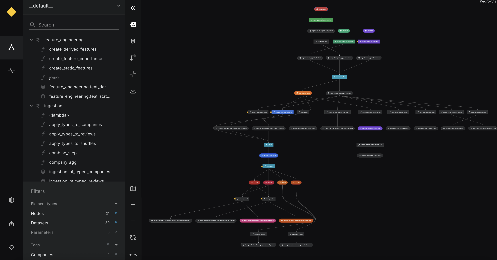

# Customize node styling in Kedro-Viz

From Kedro-Viz version 12.2.0, you can customize the visual appearance of nodes in your pipeline flowchart. You can apply custom colors, styling, and theme-specific appearances to individual nodes to help distinguish different types of operations, highlight important components, or create visual groupings in your pipeline.



## Overview

Node styling enables you to:

- **Apply custom colors** to node backgrounds, borders, and text
- **Set theme-specific styles** that automatically switch between light and dark modes  
- **Highlight specific nodes** with custom styling to draw attention
- **Create visual categories** by styling nodes according to their function or importance
- **Improve readability** of complex pipelines through strategic use of color and styling

## Setting up node styles

To customize node styling, create a `styles.json` file in your project's `.viz` directory:

```
your-kedro-project/
├── .viz/
│   └── styles.json    # Node styling configuration
├── conf/
├── data/
└── src/
```

!!! info
    The `.viz` directory is automatically created when you run `kedro run`. If it doesn't exist, create it manually in your project root.

## Basic styling configuration

The `styles.json` file uses a simple JSON structure where each node name maps to its styling properties:

```json
{
  "node_name": {
    "fill": "#ff6b6b",
    "stroke": "#d63447",
    "color": "#ffffff"
  }
}
```

### Example: Basic node styling

```json
{
  "data_processing.preprocessing_node": {
    "fill": "#4ecdc4",
    "stroke": "#26d0ce",
    "color": "#ffffff"
  },
  "data_science.train_model": {
    "fill": "#45b7d1", 
    "stroke": "#3a9bc1",
    "color": "#ffffff"
  },
  "reporting.create_visualization": {
    "fill": "#f9ca24",
    "stroke": "#f0932b",
    "color": "#2f3542"
  }
}
```

!!! tip
    You can use any valid CSS color format: hex codes (`#ff6b6b`), RGB values (`rgb(255, 107, 107)`), HSL values (`hsl(0, 100%, 71%)`), or named colors (`red`).

## Theme-specific styling

Kedro-Viz supports both light and dark themes. You can define different styles for each theme using the `themes` property:

```json
{
  "data_processing.preprocessing_node": {
    "fill": "#4ecdc4",
    "themes": {
      "light": {
        "fill": "#4ecdc4",
        "stroke": "#26d0ce",
        "color": "#ffffff"
      },
      "dark": {
        "fill": "#2d5a87", 
        "stroke": "#1e3f5f",
        "color": "#e0e6ed"
      }
    }
  }
}
```

### How theme styling works

1. **Root-level properties** are applied first as default styles
2. **Theme-specific properties** override defaults when that theme is active
3. **Theme switching** automatically updates node appearance in real-time

### Example: Complete theme-aware configuration

```json
{
  "data_processing.clean_data": {
    "fill": "#4ecdc4",
    "themes": {
      "light": {
        "fill": "#e8f5e8",
        "stroke": "#4caf50", 
        "color": "#2e7d32"
      },
      "dark": {
        "fill": "#1b5e20",
        "stroke": "#4caf50",
        "color": "#c8e6c9"
      }
    }
  },
  "model_training.train_classifier": {
    "fill": "#4ecdc4",
    "themes": {
      "light": {
        "fill": "#e3f2fd",
        "stroke": "#2196f3",
        "color": "#0d47a1"
      },
      "dark": {
        "fill": "#0d47a1", 
        "stroke": "#2196f3",
        "color": "#bbdefb"
      }
    }
  }
}
```

## Advanced styling patterns

### Category-based styling

Group related nodes by function using consistent color schemes:

```json
{
  "data_processing.load_data": {
    "fill": "#e8f5e8",
    "stroke": "#4caf50",
    "color": "#2e7d32"
  },
  "data_processing.clean_data": {
    "fill": "#e8f5e8", 
    "stroke": "#4caf50",
    "color": "#2e7d32"
  },
  "model_training.feature_engineering": {
    "fill": "#e3f2fd",
    "stroke": "#2196f3", 
    "color": "#0d47a1"
  },
  "model_training.train_model": {
    "fill": "#e3f2fd",
    "stroke": "#2196f3",
    "color": "#0d47a1"
  },
  "reporting.generate_report": {
    "fill": "#fff3e0",
    "stroke": "#ff9800",
    "color": "#e65100"
  }
}
```

### Status-based styling

Use colors to indicate node status or importance:

```json
{
  "critical_data_validation": {
    "fill": "#ffebee",
    "stroke": "#f44336",
    "color": "#c62828"
  },
  "experimental_feature": {
    "fill": "#f3e5f5",
    "stroke": "#9c27b0",
    "color": "#6a1b9a",
    "opacity": "0.8"
  },
  "deprecated_node": {
    "fill": "#fafafa",
    "stroke": "#9e9e9e",
    "color": "#616161",
    "opacity": "0.6"
  }
}
```

## Finding node names

To style a specific node, you need its exact name as it appears in your Kedro pipeline. You can find node names by:

1. **In Kedro-Viz**: Hover over nodes to see their names in tooltips
2. **In your code**: Check your pipeline definitions in Python files
3. **Using Kedro CLI**: Run `kedro catalog describe-datasets` to see dataset names
4. **In the node list**: Use the expandable node list panel in Kedro-Viz

!!! tip
    Node names in `styles.json` must exactly match the names shown in Kedro-Viz. They are case-sensitive and should include any namespace prefixes (e.g., `data_processing.clean_data`).

## Applying your styles

1. **Create or edit** `.viz/styles.json` with your styling configuration
2. **Restart Kedro-Viz** by running `kedro viz run` again
3. **Refresh your browser** to see the updated node styling
4. **Switch themes** using the theme toggle to verify theme-specific styles

!!! info
    Changes to `styles.json` require restarting Kedro-Viz to take effect. The styles are loaded when the server starts.

## Troubleshooting

### Styles not appearing

- **Check file location**: Ensure `styles.json` is in the `.viz` directory at your project root
- **Verify JSON syntax**: Use a JSON validator to check for syntax errors
- **Match node names exactly**: Node names are case-sensitive and must match exactly
- **Restart Kedro-Viz**: Changes require a server restart to take effect

### Invalid styling properties

- **Valid CSS colors**: Use proper color formats (`#ff0000`, `rgb(255,0,0)`, or `red`)
- **Check property names**: Ensure you're using supported CSS property names

### Theme switching issues

- **Define both themes**: Include both `light` and `dark` theme objects
- **Test both modes**: Switch themes in Kedro-Viz to verify both work correctly
