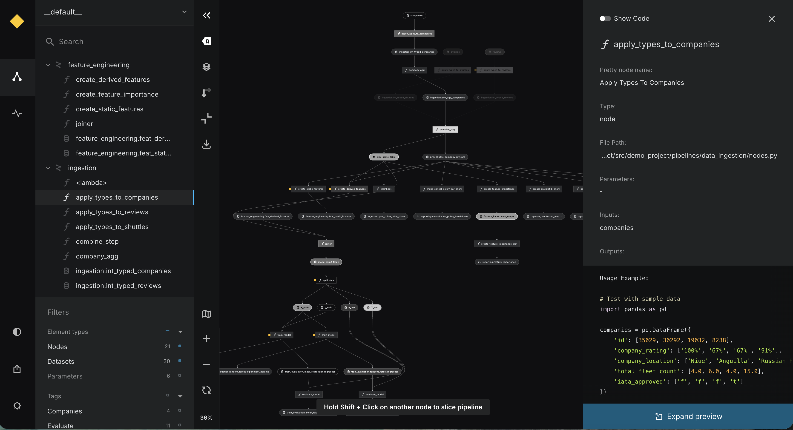
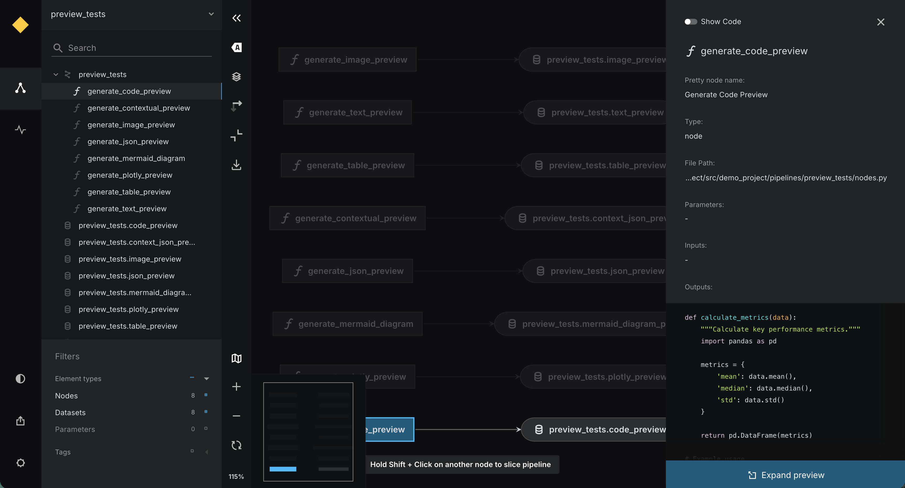
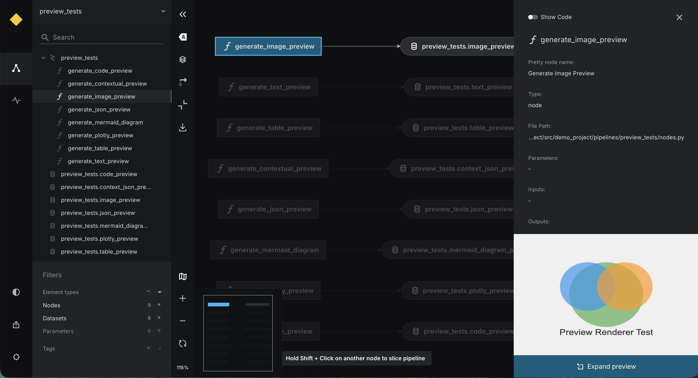

# Preview nodes in Kedro-Viz

!!! warning
    This functionality is experimental and may change or be removed in future releases. Experimental features follow the process described in  [`docs/about/experimental.md`](https://docs.kedro.org/en/stable/about/experimental/).

This page describes how Kedro-Viz displays preview functions attached to Kedro nodes. Node previews provide helpful debugging information and visualisations directly in the Kedro-Viz interface.

Starting from Kedro 1.2.0 and Kedro-Viz 12.3.0, preview functions can be attached to nodes using the `preview_fn` parameter. These preview functions return lightweight summaries, diagrams, or visualisations that help you understand what a node is doing without running the full pipeline.

## What are node previews ?

Node previews are functions attached to pipeline nodes that generate visualisations or summaries. When you click on a node in Kedro-Viz, the preview appears in the metadata panel, like dataset previews.

Node previews can help you understand:

- What a node does without reading its implementation
- Node configuration and parameters
- Internal workflows or decision logic
- Expected behavior or outputs

## Supported preview types in Kedro-Viz

Kedro-Viz supports three preview types for nodes:

### Mermaid preview

Displays flowcharts, sequence diagrams, and other [Mermaid](https://mermaid.js.org/) visualisations. Useful for showing workflows, decision logic, or process flows within a node.

### Text preview

Displays text summaries, logs, or formatted code with syntax highlighting. Useful for showing configuration details, documentation, or code snippets.

### Image preview

Displays images using URLs or base64-encoded data uniform resource identifiers. Useful for showing static diagrams, charts, or reference images.

!!! info
    Kedro supports additional preview types (JsonPreview, TablePreview, PlotlyPreview, CustomPreview) that are not yet rendered in Kedro-Viz. Support for these types may be added in future releases.

## How to create and configure node previews

To learn how to add preview functions to your nodes, including detailed examples and configuration options, see the [Kedro documentation on preview functions](https://docs.kedro.org/en/stable/build/nodes/#how-to-add-preview-functions-to-nodes).

The Kedro documentation covers:

- How to attach preview functions to nodes using the `preview_fn` parameter
- Code examples for all preview types
- Configuration options for customising previews (for example, Mermaid rendering options, syntax highlighting languages)
- Using closures to capture context
- Best practices and guidelines

## Viewing node previews in Kedro-Viz

After adding preview functions to your nodes:

1. Run `kedro viz` to start Kedro-Viz
2. Click on any node that has a preview function
3. The preview will appear in the metadata panel on the right side
4. MermaidPreview displays as an interactive diagram
5. TextPreview displays as formatted text with optional syntax highlighting
6. ImagePreview displays the image inline

## Differences from dataset previews

Node previews differ from dataset previews in several ways:

| Aspect | Dataset Previews | Node Previews |
|--------|------------------|---------------|
| **What they show** | Actual data content | Node behaviour/configuration |
| **When they run** | After data is loaded | Defined at pipeline creation |
| **Access to data** | Full dataset access | No direct access to inputs/outputs |
| **Primary use case** | Inspect data quality | Understand node logic |
| **Enabled by default** | Yes (since Kedro-Viz 8.0.0) | When `preview_fn` is provided |

!!! tip
    Node previews work alongside dataset previews to give you a complete view of your pipeline's behavior.
