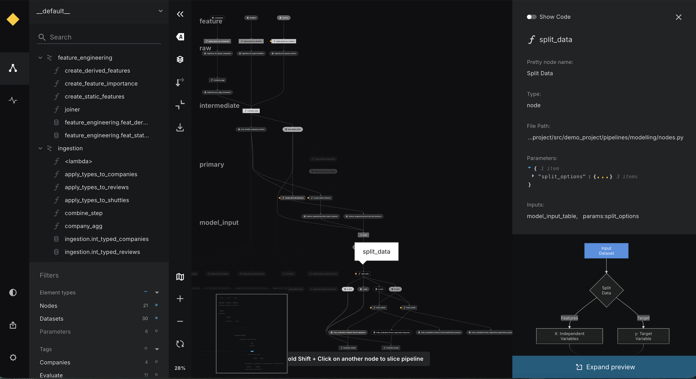

# Preview nodes in Kedro-Viz

!!! warning
    This functionality is experimental and may change or be removed in future releases. Experimental features follow the process described in  [`docs/about/experimental.md`](https://docs.kedro.org/en/stable/about/experimental/).

Starting from Kedro 1.2.0 and Kedro-Viz 12.3.0, you can attach preview functions to nodes using the `preview_fn` parameter. When you click on a node in Kedro-Viz, the preview appears in the metadata panel, like dataset previews.

Node previews help you understand node behaviour without reading implementation code, including:

- Node configuration and parameters
- Internal workflows or decision logic
- Expected behaviour or outputs

## How to create and configure node previews

To learn how to add preview functions to your nodes, including detailed examples and configuration options, see the [Kedro documentation on preview functions](https://docs.kedro.org/en/stable/build/nodes/#how-to-add-preview-functions-to-nodes).

## Supported preview types in Kedro-Viz

Kedro-Viz supports three preview types for nodes:

### Mermaid preview

Displays flowcharts, sequence diagrams, and other [Mermaid](https://mermaid.js.org/) visualisations. Useful for showing workflows, decision logic, or process flows within a node.

### Text preview

Displays text summaries, logs, usage examples or testing information with code snippets and syntax highlighting.

### Image preview

Displays images using URLs or base64-encoded data uniform resource identifiers. Useful for showing static diagrams, charts, or reference images.

## Differences from dataset previews

Node previews differ from dataset previews in several ways:

| Aspect | Dataset Previews | Node Previews |
|--------|------------------|---------------|
| **What they show** | Actual data content | Node behaviour/configuration |
| **When they run** | After data is loaded | Defined at pipeline creation |
| **Access to data** | Full dataset access | No direct access to inputs/outputs |
| **Primary use case** | Inspect data quality | Understand node logic |
| **Enabled by default** | Yes (since Kedro-Viz 8.0.0) | When `preview_fn` is provided |

!!! tip
    Node previews work alongside dataset previews to give you a complete view of your pipeline's behaviour.
