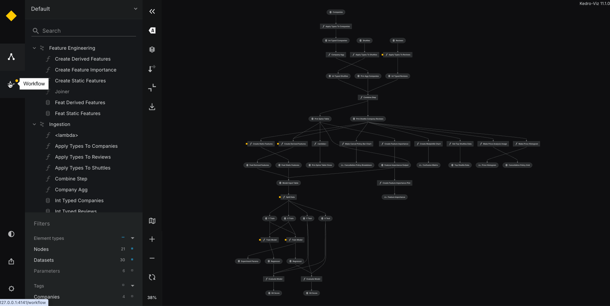

# Run Status tracking in Kedro-Viz

The Run Status feature in Kedro-Viz provides tracking and visualisation of your pipeline execution, giving you detailed insights into your workflow's performance and helping you quickly identify and debug issues.

## Overview

Run Status tracks three main aspects of your pipeline execution:

1. **Pipeline execution**: Overall run status, duration, and timing
2. **Node execution**: Individual node performance, success/failure status, and execution time
3. **Dataset operations**: Dataset loading and saving operations with size information

The feature automatically collects execution data during your `kedro run` and presents it in an intuitive visual format within the Kedro-Viz interface.

## Getting started

### Prerequisites

- Kedro-Viz must be installed in your environment
- Your project must be a valid Kedro project

### Running a pipeline with Run Status tracking

To generate run status data, simply execute your pipeline using the standard Kedro command:

```bash
kedro run
```

This will:
- Execute your pipeline normally
- Automatically collect execution statistics and timing information
- Generate run status data in the `.viz/kedro_pipeline_events.json` file

Once the run is complete, you can visualise the results:

```bash
kedro viz run
```

Navigate to the **Workflow** view to see your run status information.

## Understanding the Workflow view

The Workflow view provides an overview of your pipeline execution with the following components:

### Run Status Notification

After a pipeline run, you'll see a notification banner displaying:

- **Success notification**: "Run execution completed successfully in [duration]"
- **Failure notification**: "Run execution failed"
- **Completion timestamp**: When the run finished
- **Duration**: Total execution time (for successful runs)

### Visual status indicators

Each node in the workflow view shows visual indicators:

- **Success**: Green indicators for successfully executed nodes
- **Failure**: Red indicators for failed nodes
- **Skipped/Not executed**: Gray indicators for nodes that didn't run

## Run Status scenarios

The following examples demonstrate how Run Status appears in different pipeline execution scenarios:

### Successful pipeline execution


When all nodes execute successfully, you'll see green indicators and a success notification.

### Node execution failure


When a node fails during execution, you'll see red indicators on the failed node and an error notification.

### Dataset missing error


When a required dataset is missing, the pipeline fails early and shows specific dataset error information.

!!! info
    Currently, Run Status tracking is available for **full pipeline runs only**. Partial pipeline runs (using `--from-nodes`, `--to-nodes`, `--tags`, etc.) are not tracked in the current version.

The following run commands are supported:
- `kedro run` (default pipeline)

## API endpoint

The Run Status feature is powered by the `/api/run-status` REST endpoint, which returns structured data about pipeline execution:

```json
{
  "nodes": {
    "node_id": {
      "status": "success",
      "duration": 0.123,
      "error": null
    }
  },
  "datasets": {
    "dataset_id": {
      "name": "dataset_name",
      "size": 1024,
      "status": "success",
      "error": null
    }
  },
  "pipeline": {
    "run_id": "unique-run-id",
    "start_time": "2023-05-14T10:15:30Z",
    "end_time": "2023-05-14T10:20:45Z",
    "duration": 315.25,
    "status": "success",
    "error": null
  }
}
```
