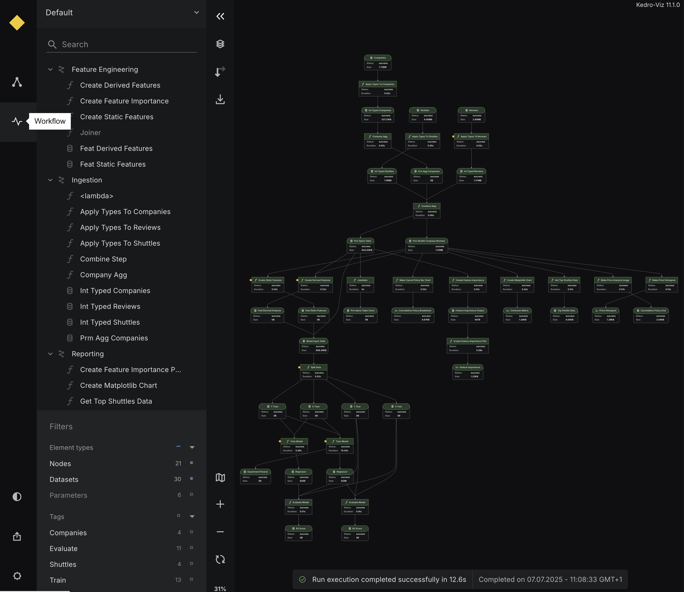

# Visualise pipeline execution with the Kedro-Viz Workflow

From Kedro-Viz 12.0.0 onwards, the Workflow view lets you visualise your `kedro run` to better understand how your pipeline executed. You can quickly spot which nodes succeeded, failed, or were skipped — making it easier to debug and inspect your workflow.

## Overview

The Workflow view gives you a visual summary of your most recent pipeline run, helping you quickly understand what happened during execution and where things might have gone wrong.

It captures and displays three key aspects of your workflow:

1. **Pipeline execution**: See the overall run status, start/end time, and total duration.
2. **Node execution**: View individual node statuses — including success, failure, or skipped — along with how long each node took to run.
3. **Dataset operations**: Inspect what datasets were loaded or saved, along with their sizes.

If a node fails, the Workflow view will also surface the traceback error, so you can debug issues directly without digging through logs.

This data is automatically collected when you run your pipeline with Kedro and displayed as an interactive visualization in Kedro-Viz.

## Getting started

### Prerequisites

- Kedro-Viz must be installed in your environment
- Your project must be a valid Kedro project

### Run a pipeline

To generate run status data, simply execute your pipeline using the standard Kedro command:

```bash
kedro run
```

!!! info
    - Run Status tracking is currently only available for full pipeline runs using `kedro run`. Partial pipeline runs (using `--from-nodes`, `--to-nodes`, `--tags`, `--pipeline`, etc.) are not supported and will not generate run status data.
    - Only SequentialRunner is supported. ParallelRunner and ThreadRunner are not supported at this time.

This will:

- Execute your pipeline normally
- Automatically collect execution statistics and timing information
- Generate run status data in the `.viz/kedro_pipeline_events.json` file

Once the run is complete, you can visualise the results:

```bash
kedro viz run
```

Navigate to the **Workflow** view to see your run status information.



## Run Status scenarios

The following examples demonstrate how Run Status appears in different pipeline execution scenarios:

### Successful pipeline execution


When all nodes execute successfully, you'll see green indicators and a success notification.

### Node execution failure


When a node fails during execution, you'll see red indicators on the failed node and an error notification.

### Dataset missing error


When a required dataset is missing, the pipeline fails early and shows specific dataset error information.
