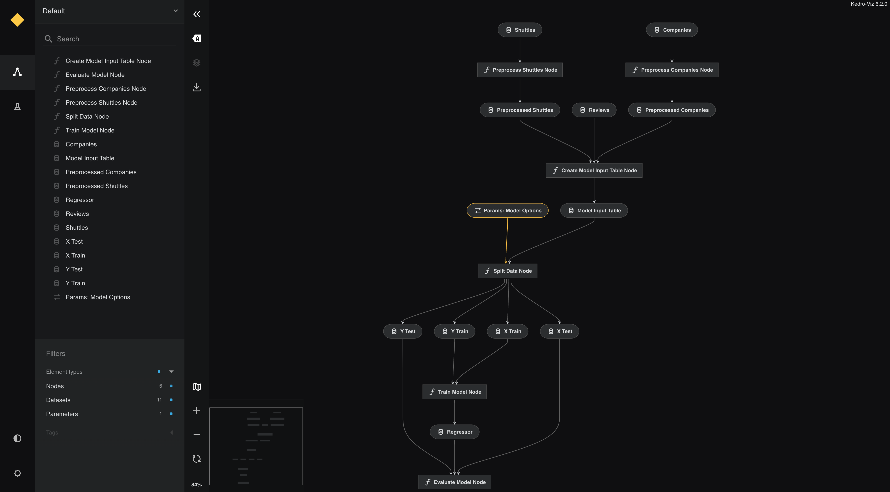
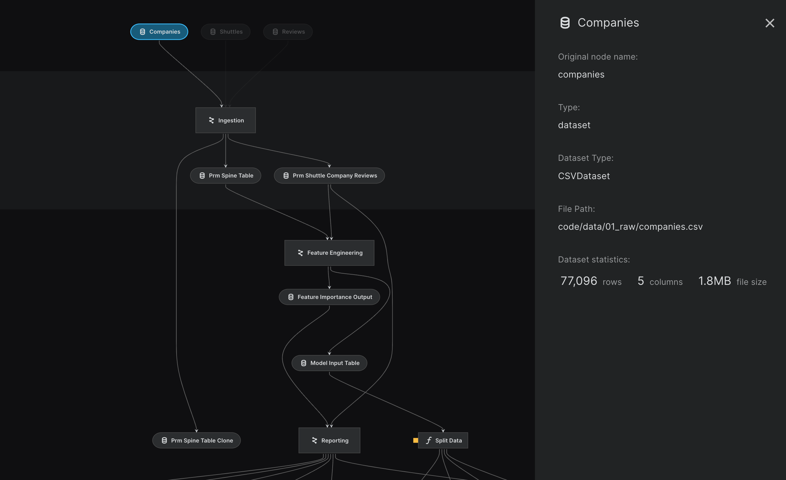
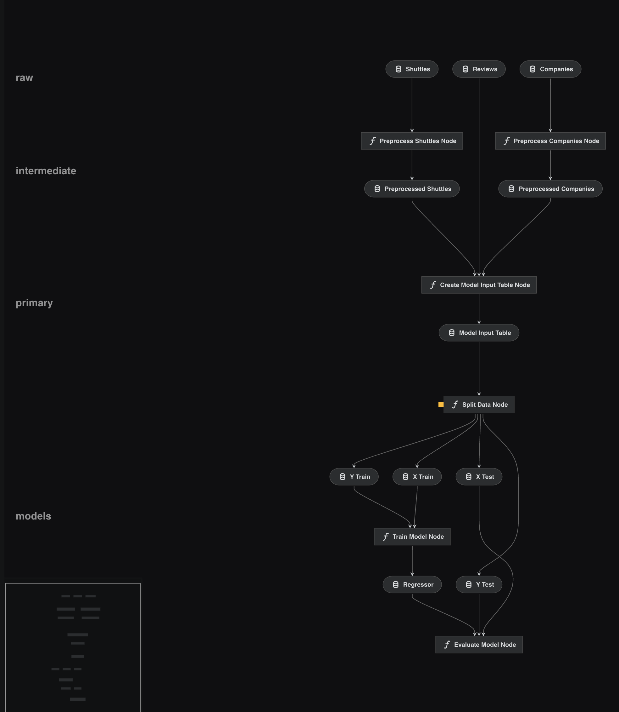
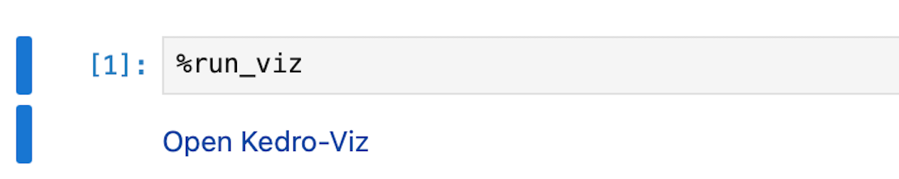
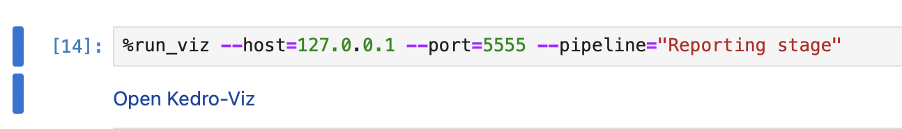
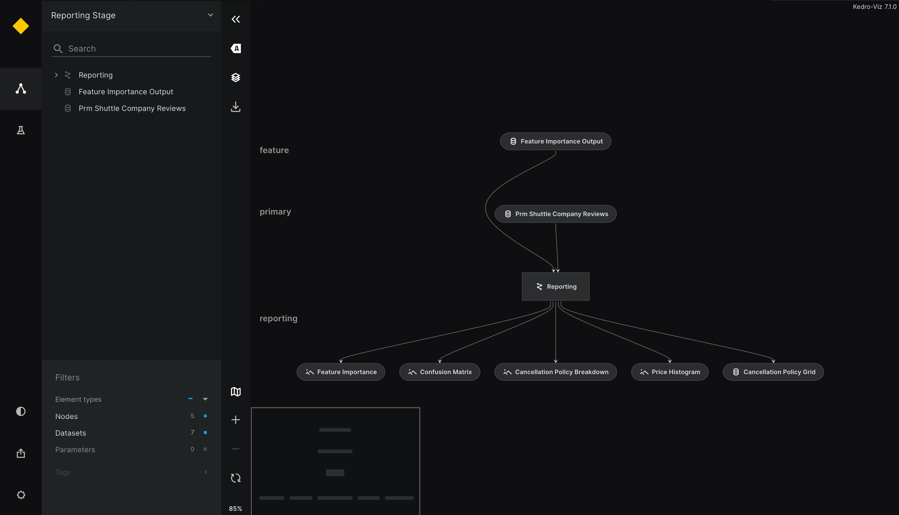
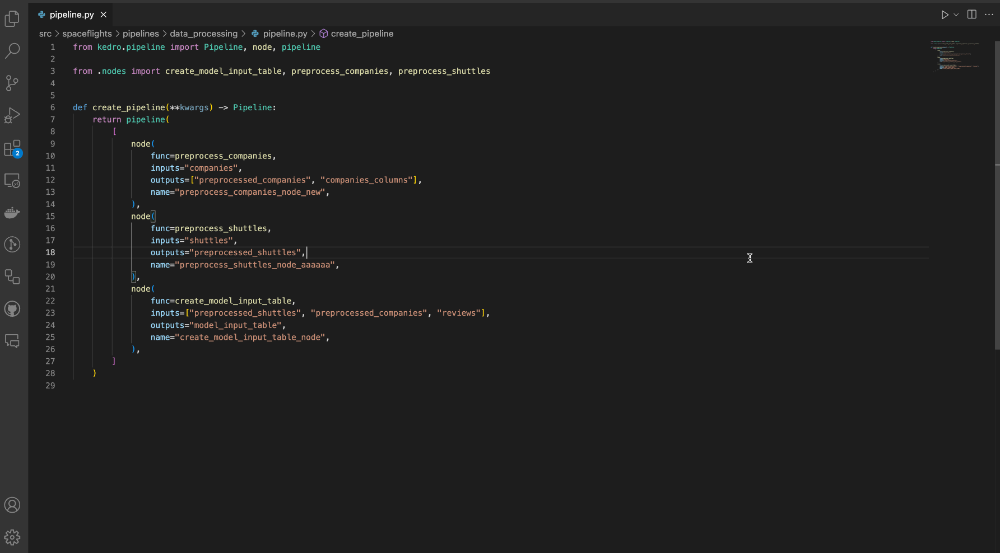

# How to visualise a Kedro project


This section assumes you are familiar with the basic Kedro concepts described in the {doc}`spaceflights tutorial<kedro:tutorial/spaceflights_tutorial>`. If you have not yet worked through the tutorial, you can still follow this example.

If you haven't installed Kedro {doc}`follow the documentation to get set up<kedro:get_started/install>`. 

```{important}
We recommend that you use the same version of Kedro that was most recently used to test this tutorial (0.19.0). To check the version installed, type `kedro -V` in your terminal window.
```

Once you have installed Kedro, you can install Kedro-viz

```bash
pip install kedro-viz
```

```{note}
[Kedro Viz](https://github.com/kedro-org/kedro-viz) supports all Python versions that are actively maintained by the CPython core team. When a [Python version reaches end of life](https://devguide.python.org/versions/#versions), support for that version is dropped from Kedro-viz. This is not considered a breaking change.
```

In your terminal window, navigate to the folder you want to store the project. Generate the spaceflights tutorial project with all the code in place by using the [Kedro starter for the spaceflights tutorial](https://github.com/kedro-org/kedro-starters/tree/main/spaceflights-pandas):


```bash
kedro new --starter=spaceflights-pandas
```

When prompted for a project name, you can enter anything, but we will assume `Spaceflights` throughout.

When your project is ready, navigate to the root directory of the project and install the dependencies for the project, which include Kedro-Viz:

```bash
pip install -r src/requirements.txt
```

The next step is optional, but useful to check that all is working. Run the full set of pipelines for the tutorial project:

```bash
kedro run
```

To start Kedro-Viz, type the following into your terminal from the project directory:

```bash
kedro viz run
```

```{note}
You can also type `kedro viz` to start Kedro-viz
```

The command opens a browser tab to serve the visualisation at `http://127.0.0.1:4141/`.

You should see the following:



If a visualisation panel opens up and a pipeline is not visible, refresh the view. If you still don't see the visualisation, the Kedro community can help:

* use the [#questions channel](https://slack.kedro.org/) on our Slack channel to ask the community for help
* search the [online archive of Slack discussions](https://linen-slack.kedro.org/)

To exit the visualisation, close the browser tab. To regain control of the terminal, enter `^+c` on Mac or `Ctrl+c` on Windows or Linux machines.

Kedro-Viz provides stats related to datasets under the metadata panel



These stats are generated by hooks. If you have Kedro-Viz installed and execute `kedro run`, the hooks will generate the stats by default. To disable this, you can disable Kedro-Viz hooks in the settings file of your project.

```{note}
Starting from Kedro-Viz 9.2.0, the dataset stats file `stats.json` will be moved to `.viz` directory at the root of your Kedro project in-case you have `kedro-viz` installed and had not disabled hooks for `kedro-viz` plugin.
```

## Visualise a Kedro project without installing project dependencies

You can use the experimental `--lite` flag to visualise your pipelines without installing Kedro project dependencies. Add the flag to the command you use to start Kedro-Viz:

```bash
kedro viz run --lite
```

```{important}
Since this is an experimental feature, Kedro-Viz will run with limited functionality and you should see a warning message in your terminal informing you about any missing dependencies.
```

Some of the known limitations while using `--lite` flag:

* If the datasets are not resolved, they will be defaulted to a custom dataset `UnavailableDataset`. 
* The flowchart will not show the layers information for the datasets.
* Experiment Tracking will not work if the pre-requisite of having kedro-datasets version 2.1.0 and above is not met.

## Automatic visualisation updates

You can use the `--autoreload` flag to autoreload Kedro-Viz when a `Python` or `YAML` file changes in the project. Add the flag to the command you use to start Kedro-Viz:

```bash
kedro viz run --autoreload
```


The `autoreload` flag reflects changes to the project as they happen. For example, commenting out `create_model_input_table_node` in `pipeline.py` will trigger a re-render of the pipeline:


## Visualise layers

By convention, a [pipeline can be defined as having different layers](https://docs.kedro.org/en/stable/resources/glossary.html#layers-data-engineering-convention) according to how data is processed.

For example, the [data engineering convention](https://towardsdatascience.com/the-importance-of-layered-thinking-in-data-engineering-a09f685edc71) labels datasets according to the stage of the pipeline (e.g. whether the data has been cleaned).

In Kedro version 0.18.9 we changed the way layers are defined in the Data Catalog. The definition is now included under the `metadata` key for `kedro-viz` (previously it was an attribute specified within a dataset's definition).

Here's an example of how to use the Kedro-Viz metadata to define layers:

```yaml
companies:
  type: pandas.CSVDataset
  filepath: data/01_raw/companies.csv
  metadata:
    kedro-viz:
      layer: raw
```

In earlier versions of Kedro, layers were specified within a dataset's definition in the Data Catalog, but this will **no longer be supported** from Kedro version 0.19.0. From that version onwards, your `catalog.yml` must specify layers as metadata.

```diff
companies:
  type: pandas.CSVDataset
  filepath: data/01_raw/companies.csv
-  layer: raw
+   metadata:
+     kedro-viz:
+       layer: raw
```

Open `catalog.yml` for the completed spaceflights tutorial and define layers in the following way:

```yaml
companies:
  type: pandas.CSVDataset
  filepath: data/01_raw/companies.csv
  metadata:
    kedro-viz:
      layer: raw

reviews:
  type: pandas.CSVDataset
  filepath: data/01_raw/reviews.csv
  metadata:
    kedro-viz:
      layer: raw

shuttles:
  type: pandas.ExcelDataset
  filepath: data/01_raw/shuttles.xlsx
  metadata:
    kedro-viz:
      layer: raw

preprocessed_companies:
  type: pandas.ParquetDataset
  filepath: data/02_intermediate/preprocessed_companies.pq
  metadata:
    kedro-viz:
      layer: intermediate

preprocessed_shuttles:
  type: pandas.ParquetDataset
  filepath: data/02_intermediate/preprocessed_shuttles.pq
  metadata:
    kedro-viz:
      layer: intermediate

model_input_table:
  type: pandas.ParquetDataset
  filepath: data/03_primary/model_input_table.pq
  metadata:
    kedro-viz:
      layer: primary

regressor:
  type: pickle.PickleDataset
  filepath: data/06_models/regressor.pickle
  versioned: true
  metadata:
    kedro-viz:
      layer: models
```

The visualisation now includes the layers:



## Share a pipeline visualisation

You can save a pipeline structure within a Kedro-Viz visualisation directly from the terminal as follows:

```bash
kedro viz run --save-file=my_shareable_pipeline
```

This command saves your visualisation in a `my_shareable_pipeline` folder, which contains all pipeline and node information from your Kedro project.

To visualise your saved Kedro-Viz, load the `my_shareable_pipeline` folder from the terminal with:

```bash
kedro viz run --load-file=my_shareable_pipeline
```

```{note}
This way of sharing requires a Kedro environment setup. 

For users who prefer not to set up a Kedro environment, [Kedro-Viz visualisations can also be shared via multiple hosting solutions](./share_kedro_viz).
```

## Running Kedro-viz in a notebook. 

Follow the [Jupyter notebook for Kedro project](https://docs.kedro.org/en/latest/notebooks_and_ipython/kedro_and_notebooks.html) guide on how to use a Jupyter notebook to explore elements of a Kedro project. It shows how to use `kedro jupyter notebook` to set up a notebook that has access to the `catalog`, `context`, `pipelines` and `session` variables of the Kedro project, so you can query them.

Once you have followed the steps to set up your notebook. You can use line magic to display a Kedro-Viz visualisation of your pipeline directly in your notebook.

### `%run_viz` line magic

``` {note}
If you have not yet installed [Kedro-Viz](https://github.com/kedro-org/kedro-viz) for the project, run `pip install kedro-viz` in your terminal from within the project directory.
```
The `%run_viz` line magic allows you to display an interactive visualisation of your pipeline directly in a new tab within your Jupyter notebook. You can also pass optional arguments to customise the visualisation environment, similar to how you would use the Kedro Viz command-line interface.

To use the `%run_viz` line magic without any arguments, simply run:

```ipython
%run_viz
```



#### Optional Arguments
The `%run_viz` command supports various optional arguments found in `kedro viz run`:

* `--host=<host>`: Specify the server host.
* `--port=<port>`: Set the server port.
* `--load-file=<file>`: Load a specific pipeline visualisation file.
* `--save-file=<file>`: Save the current pipeline visualisation to a file.
* `--pipeline=<name>`: Visualise a specific pipeline.
* `--env=<name>`: Set the environment for the visualisation.
* `--autoreload`: Enable automatic reloading of the visualisation when source code changes.
* `--ignore-plugins`: Ignore Kedro plugins when running the visualisation.
* `--params=<params>`: Pass additional parameters to the visualisation.

For example, to launch Kedro Viz on a specific host and port with autoreload enabled you can run:

```ipython
%run_viz --host=127.0.0.1 --port=4141 --autoreload
```




## As a standalone React component

To use Kedro-Viz as a standalone React component (for embedding Kedro-Viz in your web application), you can follow the example below:

```jsx
import KedroViz from '@quantumblack/kedro-viz';
import '@quantumblack/kedro-viz/lib/styles/styles.min.css';

const MyApp = () => <div style={{height: `100vh`}}><KedroViz data={json} options={options} /></div>;
``` 

For more information on how to use Kedro as a React component with all possible props, see [Kedro-Viz on NPM](https://www.npmjs.com/package/@quantumblack/kedro-viz)

## Kedro-Viz in Visual Studio Code Extension

To visualize Kedro project using Kedro-Viz in Visual Studio Code, follow these steps:

1. **Install Kedro Extension**:
Download Kedro extension from [marketplace](https://marketplace.visualstudio.com/items?itemName=kedro.Kedro) into Visual Studio Code.

2. **Setup Kedro Extension**:
Follow steps from [how-to-use-kedro-extension](https://github.com/kedro-org/vscode-kedro)

3. **Open the Command Palette**: 
Press `Cmd` + `Shift` + `P` (on macOS) or `Ctrl` + `Shift` + `P` (on Windows/Linux).

4. **Run Kedro-Viz**:
Type `kedro: Run Kedro Viz` and select the command.
This will launch Kedro-Viz and display your pipeline visually within the extension.


