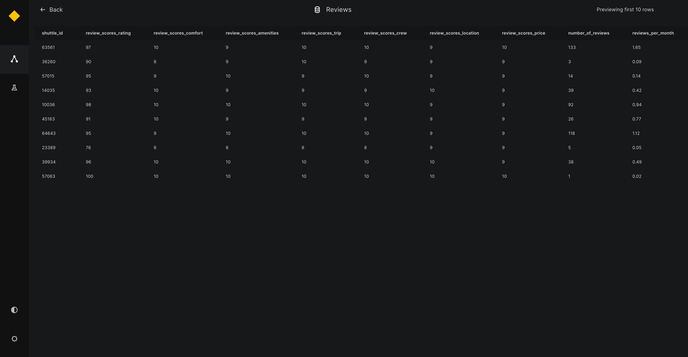

# Extend Preview to Custom Datasets

When creating a custom dataset, if you wish to enable data preview for that dataset, you must implement a `preview()` function within the custom dataset class. Kedro-Viz currently supports previewing tables, Plotly charts, images, and JSON objects.

The return type of the `preview()` function should match one of the following types, as defined in the `kedro-datasets` source code (_typing.py file):

```python
TablePreview = NewType("TablePreview", dict)
ImagePreview = NewType("ImagePreview", bytes)
PlotlyPreview = NewType("PlotlyPreview", dict)
JSONPreview = NewType("JSONPreview", dict)
```

Arbitrary arguments can be included in the `preview()` function, which can be later specified in the catalog.yml file.

Below is an example demonstrating how to implement the `preview()` function with user-specified arguments for a `CustomDataset` class that utilizes `TablePreview` to enable previewing tabular data on Kedro-Viz:

```yaml 
companies:
  type: CustomDataset
  filepath: ${_base_location}/01_raw/companies.csv
  metadata:
    kedro-viz:
      layer: raw
      preview_args:
        nrows: 5
        ncolumns: 2 
        filters: name 
```

```python 

from kedro_datasets._typing import TablePreview

class CustomDataset:
    def preview(self, nrows, ncolumns, filters) -> TablePreview:
        # Add logic for generating preview
```


## Examples of Previews:

1. TablePreview 


2. ImagePreview


3. PlotlyPreview


