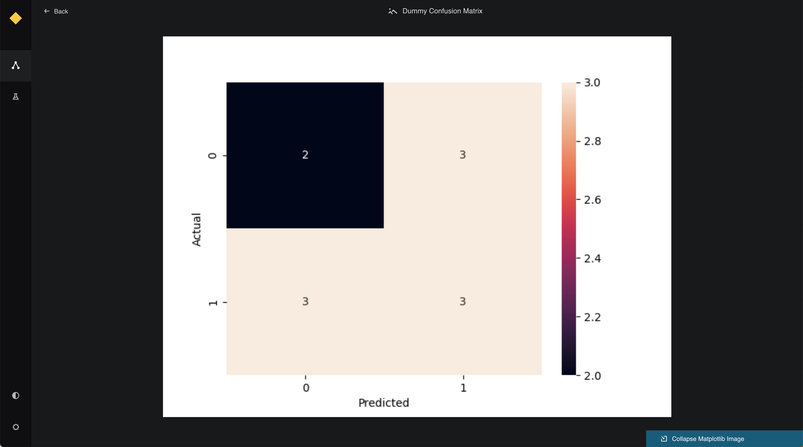

# Extend preview to custom datasets

When creating a custom dataset, if you wish to enable data preview for that dataset, you must implement a `preview()` function within the custom dataset class. Kedro-Viz currently supports previewing tables, Plotly charts, images, and JSON objects.

The return type of the `preview()` function should match one of the following types, as defined in the `kedro-datasets` source code ([_typing.py file](https://github.com/kedro-org/kedro-plugins/blob/main/kedro-datasets/kedro_datasets/_typing.py)):

```python
TablePreview = NewType("TablePreview", dict)
ImagePreview = NewType("ImagePreview", bytes)
PlotlyPreview = NewType("PlotlyPreview", dict)
JSONPreview = NewType("JSONPreview", dict)
```

## TablePreview
For `TablePreview`, the returned dictionary must contain the following keys:

`index`: A list of row indices.
`columns`: A list of column names.
`data`: A list of rows, where each row is itself a list of values.

Arbitrary arguments can be included in the `preview()` function, which can be later specified in the `catalog.yml` file. Ensure that these arguments (like `nrows`, `ncolumns`, and `filters`) match the structure of your dataset.

Below is an example demonstrating how to implement the `preview()` function with user-specified arguments for a `CustomDataset` class that utilizes `TablePreview` to enable previewing tabular data on Kedro-Viz:

```yaml 
companies:
  type: CustomTableDataset
  filepath: ${_base_location}/01_raw/companies.csv
  metadata:
    kedro-viz:
      layer: raw
      preview_args:
        nrows: 5
        ncolumns: 2 
        filters: {
          gender: male 
        } 
```

```python 

from kedro_datasets._typing import TablePreview

class CustomTableDataset:
  def preview(self, nrows, ncolumns, filters) -> TablePreview:
    data = self.load()
    for column, value in filters.items():
        data = data[data[column] == value]
    subset = data.iloc[:nrows, :ncolumns]
    preview_data = {
        'index': list(subset.index),  # List of row indices
        'columns': list(subset.columns),  # List of column names
        'data': subset.values.tolist()  # List of rows, where each row is a list of values
    }
    return preview_data
```


## ImagePreview
For `ImagePreview`, the function should return a base64-encoded string representing the image. This is typically used for datasets that output visual data such as plots or images.

Below is an example implementation:

```python

from kedro_datasets._typing import ImagePreview

class CustomImageDataset:
  def preview(self) -> ImagePreview:
    image_path = self._get_image_path()
    with open(image_path, "rb") as image_file:
        encoded_string = base64.b64encode(image_file.read()).decode('utf-8')
    return ImagePreview(encoded_string)
```



## PlotlyPreview
For `PlotlyPreview`, the function should return a dictionary containing Plotly figure data. This includes the figure's `data` and `layout` keys.

Below is an example implementation:

```python

from kedro_datasets._typing import PlotlyPreview

class CustomPlotlyDataset:
  def preview(self) -> PlotlyPreview:
    figure = self._load_plotly_figure()
    return PlotlyPreview({
        "data": figure["data"],
        "layout": figure["layout"]
    })
```


## JSONPreview
For `JSONPreview`, the function should return a dictionary representing the `JSON` data. This is useful for previewing complex nested data structures.

Below is an example implementation:

```python

from kedro_datasets._typing import JSONPreview

class CustomJSONDataset:
  def preview(self) -> JSONPreview:
    json_data = self._load_json_data()
    return JSONPreview(json.dumps(json_data))
```

