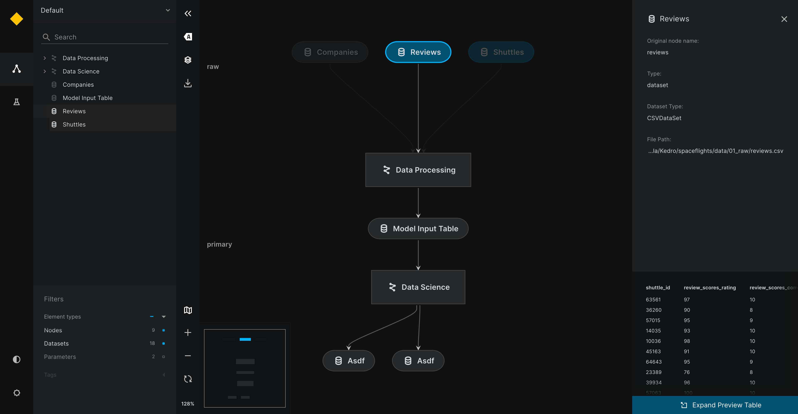

# Preview tabular data in Kedro-Viz

We use the {doc}`spaceflights tutorial<kedro:tutorial/spaceflights_tutorial>` to demonstrate how to add data preview for the `customer`, `shuttle` and `reviews` datasets. Even if you have not yet worked through the tutorial, you can still follow this example; you'll need to use the Kedro starter for the spaceflights tutorial to generate a copy of the project with working code in place.

If you haven't installed Kedro {doc}`follow the documentation to get set up<kedro:get_started/install>`. 

```{important}
We recommend that you use the same version of Kedro that was most recently used to test this tutorial (0.19.0). To check the version installed, type `kedro -V` in your terminal window.
```

In your terminal window, navigate to the folder where you want to store the project. Generate the spaceflights tutorial project with all the code in place by using the [Kedro starter for the spaceflights tutorial](https://github.com/kedro-org/kedro-starters/tree/main/spaceflights-pandas):


```bash
kedro new --starter=spaceflights-pandas
```

When prompted for a project name, you can enter anything, but we will assume `Spaceflights` throughout.

When your project is ready, navigate to the root directory of the project.

## Configure the Data Catalog

Kedro-Viz version 8.0.0 supports previews for two types of tabular datasets: `pandas.CSVDataset` and `pandas.ExcelDataset`. Previews are enabled by default, showing the first 5 rows unless otherwise specified using `preview_args`.

Example configuration in `catalog.yml`:

```yaml
companies:
  type: pandas.CSVDataset
  filepath: data/01_raw/companies.csv

reviews:
  type: pandas.CSVDataset
  filepath: data/01_raw/reviews.csv
  metadata:
    kedro-viz:
      layer: raw
      preview_args:
          nrows: 10

shuttles:
  type: pandas.ExcelDataset
  filepath: data/01_raw/shuttles.xlsx
  metadata:
    kedro-viz:
      layer: raw
      preview_args:
          nrows: 15
```

If no `preview_args` are specified, the default preview will show the first 5 rows.


## Previewing data on Kedro-Viz

After you've configured the Data Catalog, you can preview the datasets on Kedro-Viz. Start Kedro-Viz by running the following command in your terminal:

```bash
kedro viz run
```

The previews are shown as follows:

Click on each dataset node to see a small preview in the metadata panel:





View the larger preview of the dataset by clicking the `Expand Preview Table` button on the bottom of the metadata panel.


