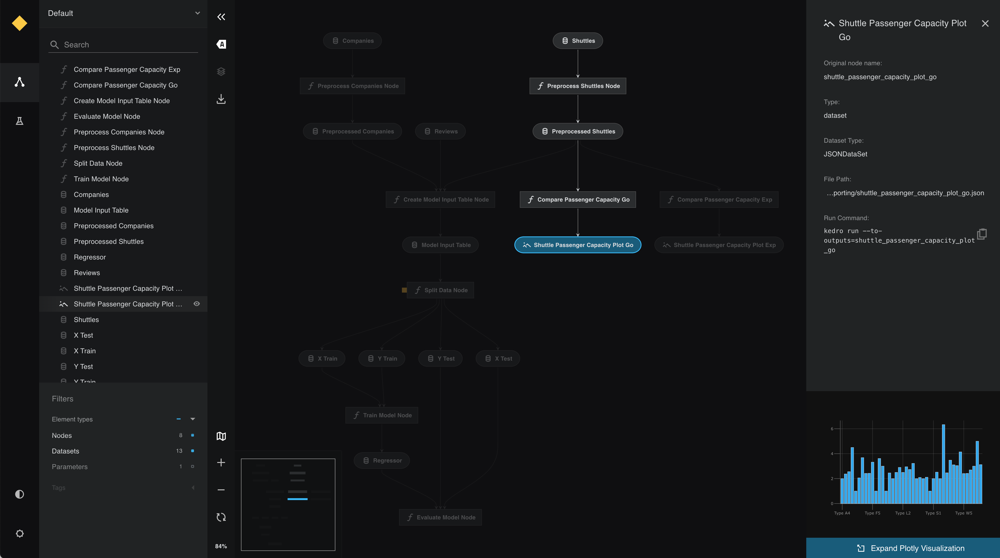
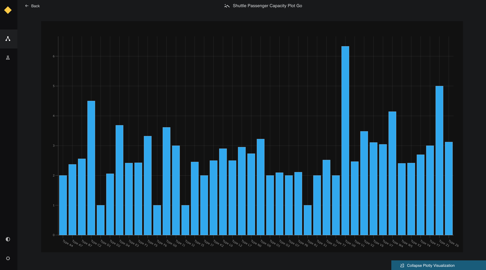

# Preview Plotly charts in Kedro-Viz

This page describes how to make interactive visualisations of a Kedro project with Kedro-Viz, which supports integration with [Plotly](https://plotly.com/python/).

We use the {doc}`spaceflights tutorial<kedro:tutorial/spaceflights_tutorial>` and add a reporting pipeline. Even if you have not yet worked through the tutorial, you can still follow this example; you'll need to use the Kedro starter for the spaceflights tutorial to generate a copy of the project with working code in place.

If you haven't installed Kedro {doc}`follow the documentation to get set up<kedro:get_started/install>`. 

```{important}
We recommend that you use the same version of Kedro that was most recently used to test this tutorial (0.19.0). To check the version installed, type `kedro -V` in your terminal window.
```

In your terminal window, navigate to the folder you want to store the project. Generate the spaceflights tutorial project with all the code in place by using the [Kedro starter for the spaceflights tutorial](https://github.com/kedro-org/kedro-starters/tree/main/spaceflights-pandas):


```bash
kedro new --starter=spaceflights-pandas
```

When prompted for a project name, you can enter anything, but we will assume `Spaceflights` throughout.

When your project is ready, navigate to the root directory of the project.

## Update the dependencies

There are two types of Plotly datasets supported by Kedro:

* `plotly.PlotlyDataset` which only supports [Plotly Express](https://plotly.com/python/plotly-express)
* `plotly.JSONDataset` which supports Plotly Express and [Plotly Graph Objects](https://plotly.com/python/graph-objects/)

To use the Plotly datasets, you must update the `requirements.txt` file in the `src` folder of the Kedro project to add the following dependencies:


```text
kedro-datasets[pandas.CSVDataset, pandas.ExcelDataset, pandas.ParquetDataset]~=1.1
kedro-datasets[plotly.PlotlyDataset, plotly.JSONDataset]~=1.1
```

Navigate to the root directory of the project in your terminal and install the dependencies for the tutorial project:

```bash
pip install -r src/requirements.txt
```

## Configure the Data Catalog

To use the datasets, add them to the Data Catalog by updating `conf/base/catalog.yml`:

```yaml
shuttle_passenger_capacity_plot_exp:
  type: plotly.PlotlyDataset
  filepath: data/08_reporting/shuttle_passenger_capacity_plot_exp.json
  versioned: true
  plotly_args:
    type: bar
    fig:
      x: shuttle_type
      y: passenger_capacity
      orientation: h
    layout:
      xaxis_title: Shuttles
      yaxis_title: Average passenger capacity
      title: Shuttle Passenger capacity

shuttle_passenger_capacity_plot_go:
  type: plotly.JSONDataset
  filepath: data/08_reporting/shuttle_passenger_capacity_plot_go.json
  versioned: true
```


## Create the template reporting pipeline

In the terminal, run the following command to generate a template for the reporting pipeline:

```bash
kedro pipeline create reporting
```

### Add the Plotly reporting nodes

Add the following to `src/spaceflights/pipelines/reporting/nodes.py`:

```python
import plotly.express as px
import plotly.graph_objs as go
import pandas as pd

# This function uses plotly.express
def compare_passenger_capacity_exp(preprocessed_shuttles: pd.DataFrame):
    return (
        preprocessed_shuttles.groupby(["shuttle_type"])
        .mean(numeric_only=True)
        .reset_index()
    )


# This function uses plotly.graph_objects
def compare_passenger_capacity_go(preprocessed_shuttles: pd.DataFrame):

    data_frame = (
        preprocessed_shuttles.groupby(["shuttle_type"])
        .mean(numeric_only=True)
        .reset_index()
    )
    fig = go.Figure(
        [
            go.Bar(
                x=data_frame["shuttle_type"],
                y=data_frame["passenger_capacity"],
            )
        ]
    )

    return fig
```

### Update the reporting pipeline code

Update `src/spaceflights/pipelines/reporting/pipeline.py` to replace the existing code with the following:

```python
from kedro.pipeline import Pipeline, node, pipeline
from .nodes import compare_passenger_capacity_exp, compare_passenger_capacity_go


def create_pipeline(**kwargs) -> Pipeline:
    """This is a simple pipeline which generates a pair of plots"""
    return pipeline(
        [
            node(
                func=compare_passenger_capacity_exp,
                inputs="preprocessed_shuttles",
                outputs="shuttle_passenger_capacity_plot_exp",
            ),
            node(
                func=compare_passenger_capacity_go,
                inputs="preprocessed_shuttles",
                outputs="shuttle_passenger_capacity_plot_go",
            ),
        ]
    )
```


## Run the pipeline

Now run the pipelines:

```bash
kedro run
```

Then visualise with `kedro viz run`

The generated charts are shown as follows:

.

Click on each of see a small preview in the metadata panel:



View the larger visualisation of the chart by clicking the 'Expand Plotly Visualisation' button on the bottom of the metadata panel.




