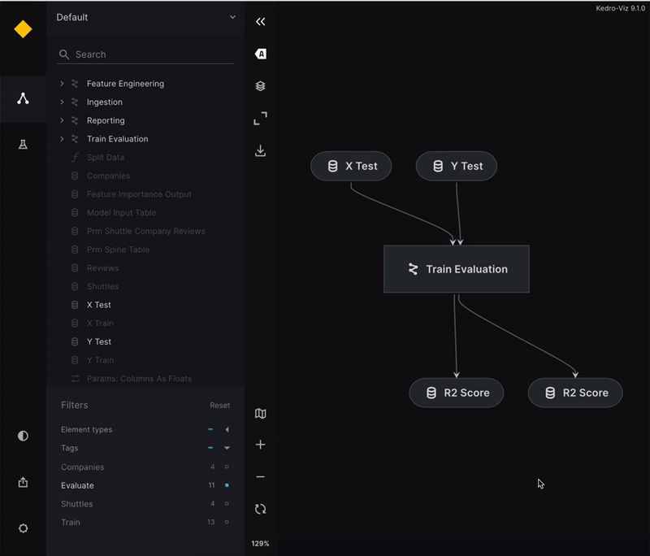

# Publish and share on AWS

This page describes how to publish Kedro-Viz on AWS to share it with others. It uses the spaceflights tutorial as an example.

## Setup your kedro project 

If you haven't installed Kedro {doc}`follow the documentation to get set up<kedro:get_started/install>`. 

```{important}
We recommend that you use the same version of Kedro that was most recently used to test this tutorial (0.19.1). To check the version installed, type `kedro -V` in your terminal window.
```

In your terminal window, navigate to the folder you want to store the project. Generate the spaceflights tutorial project with all the code in place by using the [Kedro starter for the spaceflights tutorial](https://github.com/kedro-org/kedro-starters/tree/main/spaceflights-pandas):


```bash
kedro new --starter=spaceflights-pandas
```

When prompted for a project name, you can enter anything, but we will assume `Spaceflights` throughout.

When your project is ready, navigate to the root directory of the project. Install the dependencies from the project root directory by typing the following in your terminal:

```bash
pip install -r requirements.txt
```

Kedro-Viz requires specific minimum versions of `fsspec`, and `kedro` to publish your project. Ensure you have these correct versions by updating the `requirements.txt` file of the Kedro project to add the following:

```text
fsspec>=2023.9.0
kedro>=0.18.2
```

## Install cloud dependencies

```bash
pip install 'kedro-viz[aws]'
```

## Configure your AWS S3 bucket

1. Create S3 bucket: Follow the [AWS tutorial](https://docs.aws.amazon.com/AmazonS3/latest/userguide/HostingWebsiteOnS3Setup.html) to create an S3 bucket and enable static website hosting.

```{note}
The process of uploading your site's files will be done through Kedro-Viz.
```

2. Set IAM user: Sign in to the [AWS Management Console](https://console.aws.amazon.com/s3/) and create an IAM user account. Refer to the official AWS documentation about [IAM Identities](https://docs.aws.amazon.com/IAM/latest/UserGuide/id.html).

3. Generate access keys: Create an [IAM user groups](https://docs.aws.amazon.com/IAM/latest/UserGuide/id_groups.html?icmpid=docs_iam_help_panel) with full access to the AWS S3 policy. Add the IAM user to the group and generate access keys. Refer to AWS documentation for detailed instructions on [creating and managing access keys](https://docs.aws.amazon.com/IAM/latest/UserGuide/id_credentials_access-keys.html).

## Set credentials

Once that's completed, you'll need to set your AWS credentials as environment variables in your terminal window, as shown below:

```bash
export AWS_ACCESS_KEY_ID="your_access_key_id"
export AWS_SECRET_ACCESS_KEY="your_secret_access_key"
```

For more information, see the official AWS documentation about [how to work with credentials](https://docs.aws.amazon.com/cli/latest/userguide/cli-configure-envvars.html).


## Publish and share the project

Once your cloud storage is configured and the credentials are set, you are now ready to publish and share your Kedro-Viz project. 

### Publish and share via Kedro-Viz UI 

Start Kedro-Viz by running the following command in your terminal:

```bash
kedro viz run
```

Navigate to the **Publish and share** icon located in the lower-left corner of the application interface. A modal dialog will appear, prompting you to select your hosting platform and provide your bucket name and endpoint link.

Set up endpoint
---------------

```{important}
The endpoint link can be found under **S3 bucket -> Properties -> Static website hosting -> Bucket website endpoint**.
```

Before publishing, you can enable or disable the preview for all datasets by toggling the "All dataset previews" button in the modal dialog.
Once those details are complete, click **Publish**. A hosted, shareable URL will be returned to you after the process completes.



```{note}
On Kedro-Viz version 7.0.0, you will see a modal dialog to select your region and bucket name.
```

### Publish and share via CLI

Use the `kedro viz deploy` command to publish Kedro-Viz on AWS. You can execute the following command from your project's root folder:

```bash
kedro viz deploy --platform=aws --endpoint=[s3-endpoint] --bucket-name=[s3-bucket-name]
```

If you are on Kedro-Viz 7.0.0 you can still publish and share Kedro-Viz project using the existing command 

```bash
kedro viz deploy --region=[aws-bucket-region] --bucket-name=[aws-bucket-name]
```

```{note}
Starting from Kedro-Viz 9.2.0, `kedro viz deploy` will not include dataset previews by default. To enable previews for all the datasets, use the `--include-previews` flag.
```

## Permissions and access control

Kedro-Viz does not manage permissions or access control. AWS manages all permissions and access control. As a user, you have the choice to allow anyone to view your project or restrict access to specific IP addresses, users, or groups.

Control who can access your visualization using [bucket and user policies](https://docs.aws.amazon.com/AmazonS3/latest/userguide/using-iam-policies.html) or [access control lists](https://docs.aws.amazon.com/AmazonS3/latest/userguide/acls.html). Refer to the official AWS documentation for further details.

## Billing

Kedro-Viz does not handle billing. You pay for storing objects in your S3 buckets. The amount you pay depends on your objects’ size, how long you stored the object during the month, and the storage class.

See the official [AWS documentation](https://aws.amazon.com/s3/pricing/?nc=sn&loc=4) for more information.

