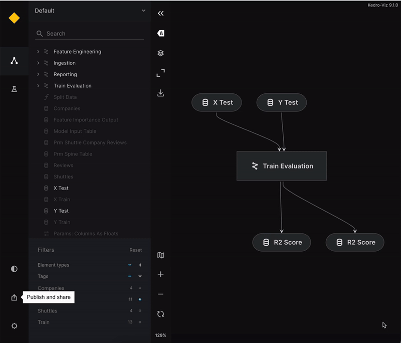

# Publish and share on Azure

This page describes how to publish Kedro-Viz on Azure to share it with others. It uses the spaceflights tutorial as an example.

## Setup your kedro project 

If you haven't installed Kedro {doc}`follow the documentation to get set up<kedro:get_started/install>`. 

```{important}
We recommend that you use the same version of Kedro that was most recently used to test this tutorial (0.19.1). To check the version installed, type `kedro -V` in your terminal window.
```

In your terminal window, navigate to the folder you want to store the project. Generate the spaceflights tutorial project with all the code in place by using the [Kedro starter for the spaceflights tutorial](https://github.com/kedro-org/kedro-starters/tree/main/spaceflights-pandas):


```bash
kedro new --starter=spaceflights-pandas
```

When prompted for a project name, you can enter anything, but we will assume `Spaceflights` throughout.

When your project is ready, navigate to the root directory of the project. Install the dependencies from the project root directory by typing the following in your terminal:

```bash
pip install -r requirements.txt
```

Kedro-Viz requires specific minimum versions of `fsspec`, and `kedro` to publish your project. Ensure you have these correct versions by updating the `requirements.txt` file of the Kedro project to add the following:

```text
fsspec>=2023.9.0
kedro>=0.18.2
```

## Install cloud dependencies
 
 Step 1:
 
```bash
pip install 'kedro-viz[azure]'
```

## Configure your Azure Blob Storage

You can host your Kedro-Viz project on Azure Blob Storage. 

1. Enable static website hosting - Follow the [Azure tutorial](https://learn.microsoft.com/en-us/azure/storage/blobs/storage-blob-static-website-how-to?tabs=azure-portal) to configure static website hosting on Azure Blob Storage. 

```{note}
The process of uploading your site's files will be done through Kedro-Viz.
```

2. Register an app: Sign in to the Azure Portal and create an [App Registration](https://learn.microsoft.com/en-us/entra/identity-platform/quickstart-register-app).

3. Obtain parameters: In the app registration's overview pane, note down the Application (Client) ID and Directory (Tenant) ID.

4. Add client secret: Create a [client secret](https://learn.microsoft.com/en-us/entra/identity-platform/quickstart-register-app#add-a-client-secret)
for the app registration.

5. Assign IAM role: Assign an [Access Control (IAM) role](https://learn.microsoft.com/en-us/azure/role-based-access-control/role-assignments-portal?tabs=delegate-condition) to the storage account.


```{note}
Kedro-Viz uses Gen2 filesystem protocol `abfs` to write files on AzureBlobStorage.
```

```{important}
Having a `$web` container in your AzureBlobStorage is mandatory to use Kedro-Viz publish and share feature on Azure. For more information, see the official Azure documentation about 
[Setting up a static website](https://learn.microsoft.com/en-us/azure/storage/blobs/storage-blob-static-website#setting-up-a-static-website).
```

## Set credentials

Once that's completed, you'll need to set your Azure credentials as environment variables in your terminal window, as shown below:

```bash
export AZURE_STORAGE_TENANT_ID="your-app-tenant-id"
export AZURE_STORAGE_CLIENT_ID="your-app-client-id"
export AZURE_STORAGE_CLIENT_SECRET="your-app-client-secret-value"
```

For more information, see the official Azure documentation about [how to work with environmental credentials](https://learn.microsoft.com/en-us/dotnet/api/azure.identity.environmentcredential?view=azure-dotnet).


## Publish and share the project

Once your cloud storage is configured and the credentials are set, you are now ready to publish and share your Kedro-Viz project. 

### Publish and share via Kedro-Viz UI 

Start Kedro-Viz by running the following command in your terminal:

```bash
kedro viz run
```

Navigate to the **Publish and share** icon located in the lower-left corner of the application interface. A modal dialog will appear, prompting you to select your hosting platform and provide your bucket name and endpoint link.

Set up endpoint
---------------

```{important}
The endpoint link can be found under **Storage account -> Capabilities -> Static website -> Primary endpoint**.
```

Once those details are complete, click **Publish**. A hosted, shareable URL will be returned to you after the process completes.



### Publish and share via CLI

Use the `kedro viz deploy` command to publish Kedro-Viz on Azure. You can execute the following command from your project's root folder:

```bash
kedro viz deploy --platform=azure --endpoint=[azure-endpoint] --bucket-name=[azure-bucket-name]
```

## Permissions and access control

Kedro-Viz does not manage permissions or access control. Azure manages all permissions and access control. As a user, you have the choice to allow anyone to view your project or restrict access to specific IP addresses, users, or groups.

You can control who can view your visualisation using [attribute-based access control](https://learn.microsoft.com/en-us/azure/storage/blobs/storage-auth-abac). See the official Azure documentation for more information.

## Billing

Kedro-Viz does not handle billing. You pay for storing objects on your AzureBlobStorage. The amount you pay depends on the volume of data stored per month, quantity and types of operations performed, along with any data transfer costs, data redundancy option selected.

See the official [Azure documentation](https://azure.microsoft.com/en-us/pricing/details/storage/blobs/) for more information.
