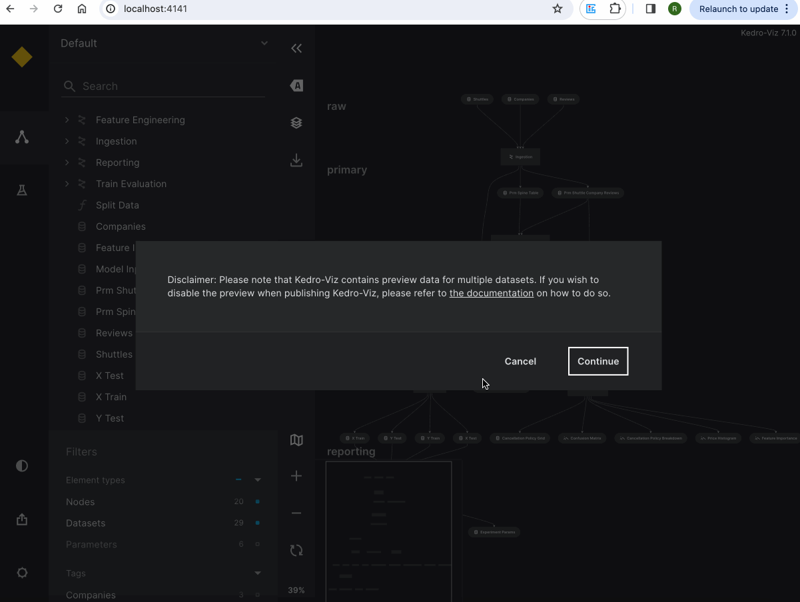

# Publish and share on GCP

This page describes how to publish Kedro-Viz on GCP to share it with others. It uses the spaceflights tutorial as an example.

## Setup your kedro project 

If you haven't installed Kedro {doc}`follow the documentation to get set up<kedro:get_started/install>`. 

```{important}
We recommend that you use the same version of Kedro that was most recently used to test this tutorial (0.19.1). To check the version installed, type `kedro -V` in your terminal window.
```

In your terminal window, navigate to the folder you want to store the project. Generate the spaceflights tutorial project with all the code in place by using the [Kedro starter for the spaceflights tutorial](https://github.com/kedro-org/kedro-starters/tree/main/spaceflights-pandas):


```bash
kedro new --starter=spaceflights-pandas
```

When prompted for a project name, you can enter anything, but we will assume `Spaceflights` throughout.

When your project is ready, navigate to the root directory of the project. Install the dependencies from the project root directory by typing the following in your terminal:

```bash
pip install -r requirements.txt
```

Kedro-Viz requires specific minimum versions of `fsspec`, and `kedro` to publish your project. Ensure you have these correct versions by updating the `requirements.txt` file of the Kedro project to add the following:

```text
fsspec>=2023.9.0
kedro>=0.18.2
```

## Install cloud dependencies

```bash
pip install 'kedro-viz[gcp]'
```

## Configure your Google Cloud Storage

You can host your Kedro-Viz project on Google Cloud Storage (GCS) bucket.

1. Enable static website hosting: Follow the [GCP tutorial](https://cloud.google.com/storage/docs/hosting-static-website) to configure static website hosting on GCS.

```{note}
The process of uploading your site's files will be done through Kedro-Viz.
```

2. Ensure the `Compute Engine API` is enabled for your project as mentioned in the tutorial.

3.  [Set up a load balancer](https://cloud.google.com/storage/docs/hosting-static-website#lb-ssl) to serve your website. If you are serving it via HTTPS, also configure an SSL certificate.

4. Obtain application credentials: Follow these steps:
    - Create a service account from the IAM & admin dashboard in the [GCP Portal](https://console.cloud.google.com/).
    - Generate a service account key and download it.

## Set credentials

Once that's completed, you'll need to set your generated service account key file absolute path as environment variable in your terminal window, as shown below:

```bash
export GOOGLE_APPLICATION_CREDENTIALS="absolute-path-to-downloaded-service-account-key-file"
```

For more information, see the official Google documentation about [how to work with environmental credentials](https://cloud.google.com/composer/docs/how-to/managing/environment-variables).


## Publish and share the project

Once your cloud storage is configured and the credentials are set, you are now ready to publish and share your Kedro-Viz project. 

### Publish and share via Kedro-Viz UI 

Start Kedro-Viz by running the following command in your terminal:

```bash
kedro viz run
```

Navigate to the **Publish and share** icon located in the lower-left corner of the application interface. A modal dialog will appear, prompting you to select your hosting platform and provide your bucket name and endpoint link.

Set up endpoint
---------------

```{important}
The endpoint link can be found under your **Application Load Balancer -> Frontend -> IP:Port**  if you are using `HTTP`. 
If you have set up SSL certificate and serve your site using `HTTPS` then provide your root domain.
```

Before publishing, you can enable or disable the preview for all datasets by toggling the "All dataset previews" button in the modal dialog.
Once those details are complete, click **Publish**. A hosted, shareable URL will be returned to you after the process completes.



### Publish and share via CLI

Use the `kedro viz deploy` command to publish Kedro-Viz on GCP. You can execute the following command from your project's root folder:

```bash
kedro viz deploy --platform=gcp --endpoint=[gcp-endpoint] --bucket-name=[gcp-bucket-name]
```

```{note}
Starting from Kedro-Viz 9.2.0, `kedro viz deploy` will not include dataset previews by default. To enable previews for all the datasets, use the `--include-previews` flag.
```

## Permissions and access control

Kedro-Viz does not manage permissions or access control. GCP manages all permissions and access control. As a user, you have the choice to allow anyone to view your project or restrict access to specific IP addresses, users, or groups.

You can control who can view your visualisation using [IAM permissions and ACLs](https://cloud.google.com/storage/docs/access-control#using_permissions_with_acls). See the official Google documentation for more information.

### Billing

Kedro-Viz does not handle billing. You pay for storing objects on your Google Cloud Storage. The amount you pay depends on the amount of data stored, data processing and network usage. Additionally you may be charged for using cloud load balancing.

See the official [Google Cloud Storage Billing](https://cloud.google.com/storage/pricing) and [Google Cloud Load Balancer Billing](https://cloud.google.com/vpc/network-pricing#lb) for more information.
