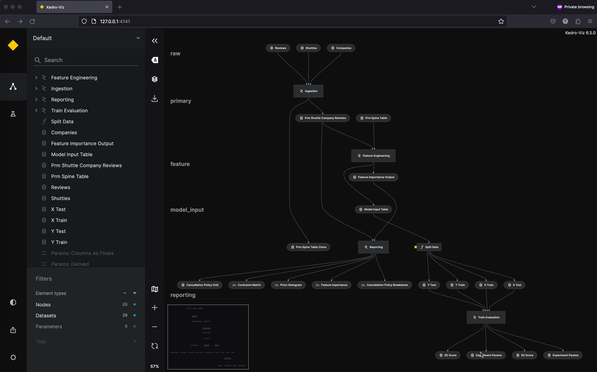

# Publish and Share via GCP

## Install dependencies

```bash
pip install 'kedro-viz[gcp]'
```

## Configure your Google Cloud Storage and set credentials

You can host your Kedro-Viz project on Google Cloud Storage bucket. You must first create a Google Cloud Storage account and make your bucket readable to anyone on the public internet. To do so, follow the [GCP tutorial](https://cloud.google.com/storage/docs/hosting-static-website) to configure a static website on Google Cloud Storage.

```{important}
You need to enable the Compute Engine API for your project as mentioned in the tutorial
```

```{note}
Uploading your site's files will be done through Kedro-Viz
```

Once the storage account is created and the bucket is made readable to anyone on the public internet, you'll need to set up a load balancer and configure SSL certificate if you want to serve your website through `HTTPS`. To do so, follow the [Setup Load Balancer tutorial](https://cloud.google.com/storage/docs/hosting-static-website#lb-ssl)

Uploading files through Kedro-Viz would require you to set `GOOGLE_APPLICATION_CREDENTIALS` as an environment variable. You will need to create a Service Account to get the required token. 

Sign in to the [GCP Portal](https://console.cloud.google.com/) and create a Service Account from IAM & Admin dashboard as shown below


You must assign `Storage Object Creator` and `Storage Object User` roles


You can ignore granting users access to this service account unless required by your project and click on Done

Once the Service Account is created, you need to generate a Service Account Key as shown below


Once that's completed, you'll need to set your generated Service Account Key file absolute path as environment variable in your terminal window, as shown below:

```bash
export GOOGLE_APPLICATION_CREDENTIALS="absolute-path-to-downloaded-service-account-key-file"
```

For more information, see the official Google documentation about [how to work with environmental credentials](https://cloud.google.com/composer/docs/how-to/managing/environment-variables).


### Permissions and access control

All permissions and access control are controlled by Google. It's up to you, the user, if you want to allow anyone to see your project or limit access to certain IP addresses, users, or groups.

You can control who can view your visualisation using [IAM permissions and ACLs](https://cloud.google.com/storage/docs/access-control#using_permissions_with_acls). See the official Google documentation for more information.

### Billing

You pay for storing objects on your Google Cloud Storage. The amount you pay depends on the amount of data stored, data processing and network usage. Additionally you may be charged for using Cloud Load Balancing.

See the official [Google Cloud Storage Billing](https://cloud.google.com/storage/pricing) and [Google Cloud Load Balancing Billing](https://cloud.google.com/vpc/network-pricing#lb) for more information.

## Publish and share the project
Once your Cloud storage is configured and the credentials are set, you are now ready to publish and share your Kedro-Viz project. Start Kedro-Viz by running the following command in your terminal:

```bash
kedro viz run
```

Click the **Publish and share** icon in the lower-left of the application. You will see a modal dialog to select your relevant AWS Bucket Region and enter your Bucket Name.

```{note}
From Kedro-Viz version 7.2.0, you will see a modal dialog to select your hosting platform, input your bucket name and endpoint link. The endpoint link can be found under your **Application Load Balancer -> Frontend -> IP:Port** if you are using `HTTP`. 
If you have set up SSL certificate and serve your site using `HTTPS` then provide your root domain.
```

Once those details are complete, click **Publish**. A hosted, shareable URL will be returned to you after the process completes.

Here is an example of the flow (TODO - Need to add flows specific to cloud provider):



```{note}
We will be updating the user flow doc for v7.2.0 soon...
```