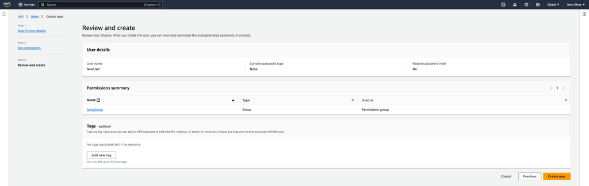
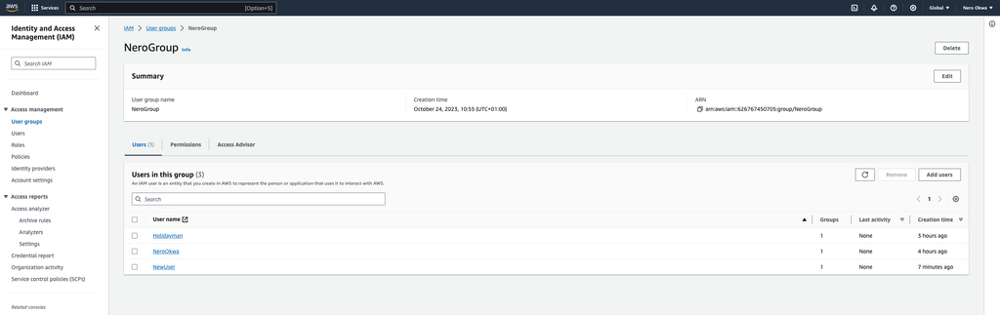
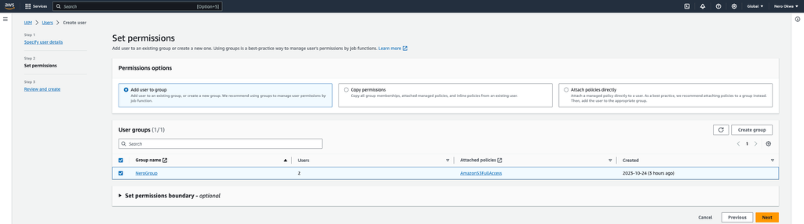
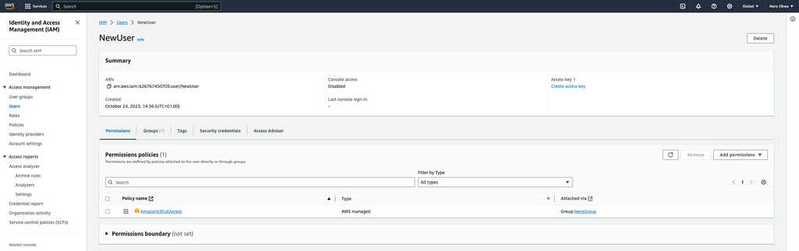
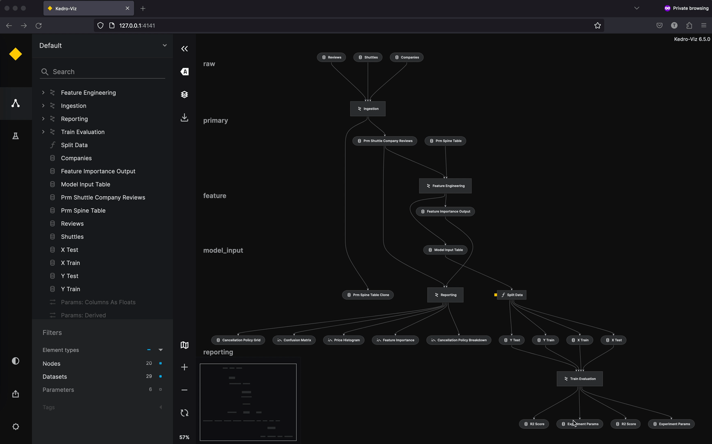

# Publish and share Kedro-Viz

```{note}
Kedro-Viz sharing was introduced in version 6.6.0.
```

This page describes how to publish Kedro-Viz so you can share it with others. It uses the {doc}`spaceflights tutorial<kedro:tutorial/spaceflights_tutorial>` as an example.

If you haven't installed Kedro {doc}`follow the documentation to get set up<kedro:get_started/install>`. 

```{important}
We recommend that you use the same version of Kedro that was most recently used to test this tutorial (0.19.0). To check the version installed, type `kedro -V` in your terminal window.
```

In your terminal window, navigate to the folder you want to store the project. Generate the spaceflights tutorial project with all the code in place by using the [Kedro starter for the spaceflights tutorial](https://github.com/kedro-org/kedro-starters/tree/main/spaceflights-pandas):


```bash
kedro new --starter=spaceflights-pandas
```

When prompted for a project name, you can enter anything, but we will assume `Spaceflights` throughout.

When your project is ready, navigate to the root directory of the project.

## Update and install the dependencies

Kedro-Viz requires specific minimum versions of `fsspec[s3]`, and `kedro` to publish your project.

You can ensure you have these correct versions by updating the `requirements.txt` file in the `src` folder of the Kedro project to the following:

```text
fsspec[s3]>=2023.9.0
kedro>=0.18.2
```

Install the dependencies from the project root directory by typing the following in your terminal:

```bash
pip install -r src/requirements.txt
```

## Configure your AWS S3 bucket and set credentials

You can host your Kedro-Viz project on Amazon S3. You must first create an S3 bucket and then enable static website hosting. To do so, follow the [AWS tutorial](https://docs.aws.amazon.com/AmazonS3/latest/userguide/HostingWebsiteOnS3Setup.html) to configure a static website on Amazon S3.


Once the S3 bucket is created, you'll need to create an Identity and Access Management (IAM) user account, user group, and generate the corresponding access keys. To do so:

Sign in to the [AWS Management Console](https://console.aws.amazon.com/s3/) and create an IAM user account.
For more information, see the official AWS documentation about [IAM Identities](https://docs.aws.amazon.com/IAM/latest/UserGuide/id.html).



Create a user group from the IAM dashboard, ensuring the user group has full access to the AWS S3 policy.



For more information, see the official AWS documentation about [IAM user groups](https://docs.aws.amazon.com/IAM/latest/UserGuide/id_groups.html?icmpid=docs_iam_help_panel).

Add the IAM user to the user group (this is only possible if the group has been created).



Select the user, then select `Create access key`. Follow the steps and create your keys.




Once that's completed, you'll need to set your AWS credentials as environment variables in your terminal window, as shown below:

```bash
export AWS_ACCESS_KEY_ID="your_access_key_id"
export AWS_SECRET_ACCESS_KEY="your_secret_access_key"
```

For more information, see the official AWS documentation about [how to work with credentials](https://docs.aws.amazon.com/cli/latest/userguide/cli-configure-envvars.html).

## Publish and share the project

You're now ready to publish and share your Kedro-Viz project. Start Kedro-Viz by running the following command in your terminal:

```bash
kedro viz run
```

Click the **Publish and share** icon in the lower-left of the application. You will see a modal dialog to select your relevant AWS Bucket Region and enter your Bucket Name.

Once those two details are complete, click **Publish**. A hosted, shareable URL will be returned to you after the process completes.

Here's an example of the flow:



From Kedro-Viz version 7.0.0, you can now publish and share your Kedro-Viz project from the command line. Use the following command from the root folder of your Kedro project

```bash
kedro viz deploy --region=[aws-bucket-region] --bucket-name=[aws-bucket-name]
```

## Permissions and access control

All permissions and access control are controlled by AWS. It's up to you, the user, if you want to allow anyone to see your project or limit access to certain IP addresses, users, or groups.

You can control who can view your visualisation using [bucket and user policies](https://docs.aws.amazon.com/AmazonS3/latest/userguide/using-iam-policies.html) or [access control lists](https://docs.aws.amazon.com/AmazonS3/latest/userguide/acls.html). See the official AWS documentation for more information.

## Billing

You pay for storing objects in your S3 buckets. The amount you pay depends on your objects’ size, how long you stored the object during the month, and the storage class.

See the official [AWS documentation](https://aws.amazon.com/s3/pricing/?nc=sn&loc=4) for more information. 
