# Publish and share Kedro-Viz

```{note}
Kedro-Viz sharing was introduced in version 6.6.0.
```

This page describes how to publish Kedro-Viz to a static website hosting platform to share it with others. It uses the {doc}`spaceflights tutorial<kedro:tutorial/spaceflights_tutorial>` as an example.

If you haven't installed Kedro {doc}`follow the documentation to get set up<kedro:get_started/install>`. 

```{important}
We recommend that you use the same version of Kedro that was most recently used to test this tutorial (0.19.0). To check the version installed, type `kedro -V` in your terminal window.
```

In your terminal window, navigate to the folder you want to store the project. Generate the spaceflights tutorial project with all the code in place by using the [Kedro starter for the spaceflights tutorial](https://github.com/kedro-org/kedro-starters/tree/main/spaceflights-pandas):


```bash
kedro new --starter=spaceflights-pandas
```

When prompted for a project name, you can enter anything, but we will assume `Spaceflights` throughout.

When your project is ready, navigate to the root directory of the project.

## Publish and share Kedro-Viz automatically

There are two ways to publish and share your Kedro-Viz:

1. You can automate the process of publishing and sharing your Kedro-Viz. This section describes the steps for AWS, which is the only cloud provider supported for automation at present. Integration with other cloud providers, namely Azure and GCP, will be added soon.

2. In the absence of automated publish and share for other platforms, there is a [manual, platform-agnostic publish and share process](#platform-agnostic-sharing-with-kedro-viz) described below. You can use the manual process for sharing on static website hosts like GitHub pages, and cloud providers like Azure and GCP.

```{note}
From Kedro-Viz version 7.2.0, you will be able to publish and share your Kedro-Viz on Azure and GCP
```

### Update and install the dependencies
Kedro-Viz requires specific minimum versions of `fsspec[s3]`, and `kedro` to publish your project. Ensure you have these correct versions by updating the `requirements.txt` file of the Kedro project to add the following:

```text
fsspec[s3]>=2023.9.0
kedro>=0.18.2
```

```{important}
From Kedro-Viz version 7.2.0, you will also need to install cloud-provider specific dependencies like `s3fs`, `adlfs`, `gcsfs`. 
```

You can run the below commands based on your cloud provider:

AWS -
```bash
pip install 'kedro-viz[aws]'
```

Azure -
```bash
pip install 'kedro-viz[azure]'
```

GCP -
```bash
pip install 'kedro-viz[gcp]'
```

Install the dependencies from the project root directory by typing the following in your terminal:

```bash
pip install -r src/requirements.txt
```

### Configure your AWS S3 bucket and set credentials

You can host your Kedro-Viz project on Amazon S3. You must first create an S3 bucket and then enable static website hosting. To do so, follow the [AWS tutorial](https://docs.aws.amazon.com/AmazonS3/latest/userguide/HostingWebsiteOnS3Setup.html) to configure a static website on Amazon S3.

Once the S3 bucket is created, you'll need to create an Identity and Access Management (IAM) user account, user group, and generate the corresponding access keys. To do so:

Sign in to the [AWS Management Console](https://console.aws.amazon.com/s3/) and create an IAM user account.
For more information, see the official AWS documentation about [IAM Identities](https://docs.aws.amazon.com/IAM/latest/UserGuide/id.html).


Create a user group from the IAM dashboard, ensuring the user group has full access to the AWS S3 policy.


For more information, see the official AWS documentation about [IAM user groups](https://docs.aws.amazon.com/IAM/latest/UserGuide/id_groups.html?icmpid=docs_iam_help_panel).

Add the IAM user to the user group (this is only possible if the group has been created).


Select the user, then select `Create access key`. Follow the steps and create your keys.


Once that's completed, you'll need to set your AWS credentials as environment variables in your terminal window, as shown below:

```bash
export AWS_ACCESS_KEY_ID="your_access_key_id"
export AWS_SECRET_ACCESS_KEY="your_secret_access_key"
```

For more information, see the official AWS documentation about [how to work with credentials](https://docs.aws.amazon.com/cli/latest/userguide/cli-configure-envvars.html).

#### Permissions and access control

All permissions and access control are controlled by AWS. It's up to you, the user, if you want to allow anyone to see your project or limit access to certain IP addresses, users, or groups.

You can control who can view your visualisation using [bucket and user policies](https://docs.aws.amazon.com/AmazonS3/latest/userguide/using-iam-policies.html) or [access control lists](https://docs.aws.amazon.com/AmazonS3/latest/userguide/acls.html). See the official AWS documentation for more information.

#### Billing

You pay for storing objects in your S3 buckets. The amount you pay depends on your objects’ size, how long you stored the object during the month, and the storage class.

See the official [AWS documentation](https://aws.amazon.com/s3/pricing/?nc=sn&loc=4) for more information.

### Configure your AzureBlobStorage and set credentials

You can host your Kedro-Viz project on AzureBlobStorage. You must first create an Azure Storage account and then enable static website hosting. To do so, follow the [Azure tutorial](https://learn.microsoft.com/en-us/azure/storage/blobs/storage-blob-static-website-how-to?tabs=azure-portal) to configure a static website on AzureBlobStorage.

```{note}
Uploading your site's files will be done through Kedro-Viz
```

Once the storage account is created and enabled for static website hosting, you'll need to register an app, get the app registration parameters namely `Application (Client) ID`, `Directory (Tenant) ID`, `Client Secret Value`. To do so:

Sign in to the [AzurePortal](https://portal.azure.com/#home) and create an App registration.
For more information, see the official Azure documentation about [App Registration](https://learn.microsoft.com/en-us/entra/identity-platform/quickstart-register-app).

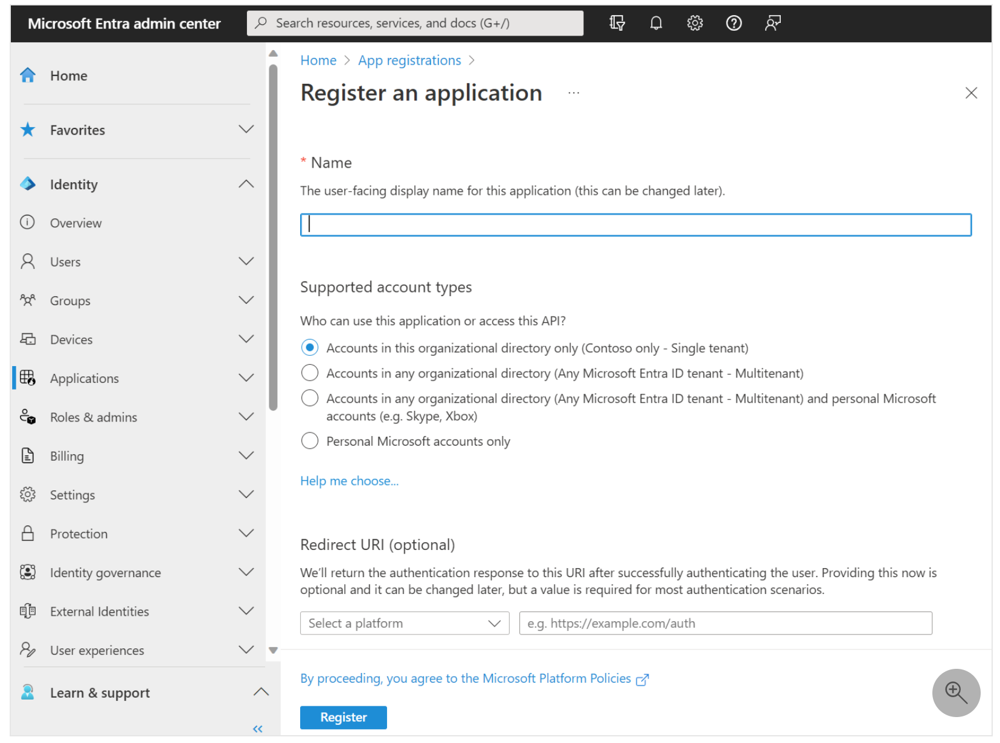

When registration finishes, the app registration's Overview pane is displayed. You see the Application (Client) ID and Directory (Tenant) ID. We will use these values to set our environment variables.

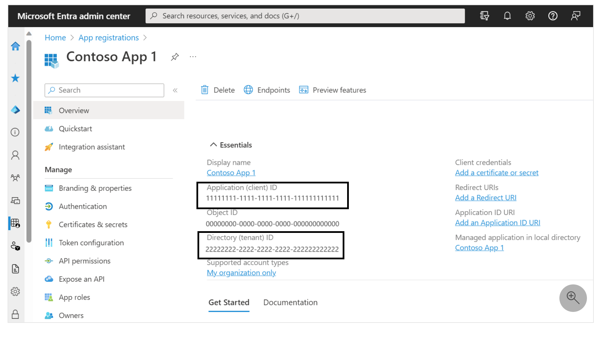

Add a Client Secret for the app registration. For more information, see [Add a client secret](https://learn.microsoft.com/en-us/entra/identity-platform/quickstart-register-app#add-a-client-secret)

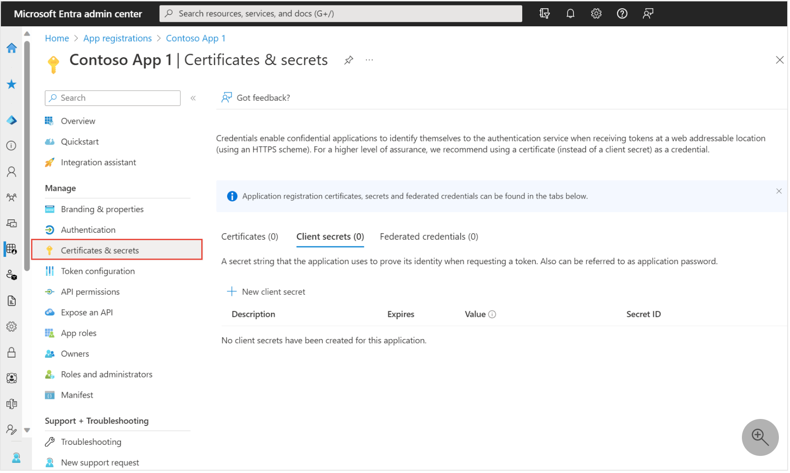

Once the Client Secret is created, the Client secrets section is displayed and you can find the Client Secret Value as shown below

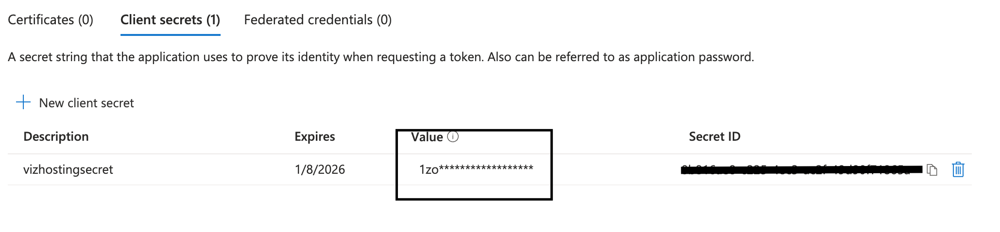

Assign Access Control (IAM) role to the storage account. For more information, see [Assign Azure roles](https://learn.microsoft.com/en-us/azure/role-based-access-control/role-assignments-portal?tabs=delegate-condition)

Go to the storage account that is created and click on Access control (IAM) as shown below

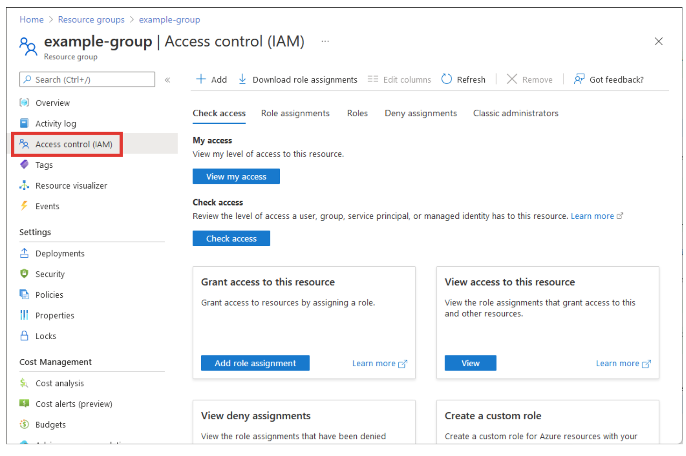

Add role assignment and select the role `Storage Blob Data Contributor` as shown below

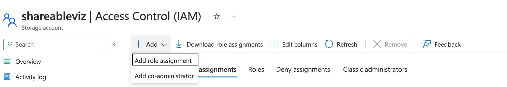

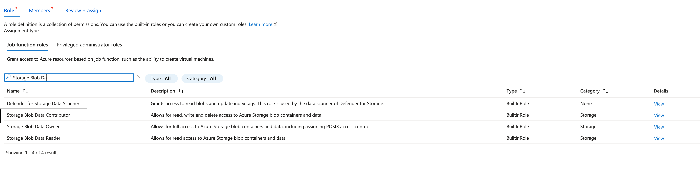

On the Members tab, select User, group, or service principal to assign the selected role to the app registration. Click on Select members, and find your app registration name by typing in the Select box as shown below 

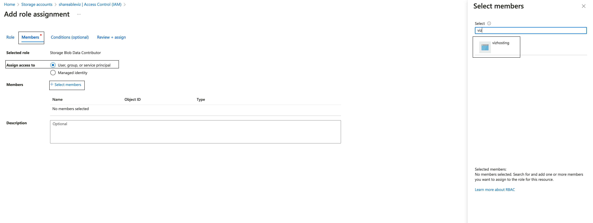

Once that's completed, you'll need to set your Azure credentials as environment variables in your terminal window, as shown below:

```bash
export AZURE_STORAGE_TENANT_ID="your-app-tenant-id"
export AZURE_STORAGE_CLIENT_ID="your-app-client-id"
export AZURE_STORAGE_CLIENT_SECRET="your-app-client-secret-value"
```

For more information, see the official Azure documentation about [how to work with environmental credentials](https://learn.microsoft.com/en-us/dotnet/api/azure.identity.environmentcredential?view=azure-dotnet).

```{note}
Kedro-Viz uses Gen2 filesystem protocol `abfs` to write files on AzureBlobStorage.
```

```{important}
Having a `$web` container in your AzureBlobStorage is mandatory to use Kedro-Viz publish and share feature on Azure. For more information, see the official Azure documentation about 
[Setting up a static website](https://learn.microsoft.com/en-us/azure/storage/blobs/storage-blob-static-website#setting-up-a-static-website).
```

#### Permissions and access control

All permissions and access control are controlled by Azure. It's up to you, the user, if you want to allow anyone to see your project or limit access to certain IP addresses, users, or groups.

You can control who can view your visualisation using [attribute-based access control](https://learn.microsoft.com/en-us/azure/storage/blobs/storage-auth-abac). See the official Azure documentation for more information.

#### Billing

You pay for storing objects on your AzureBlobStorage. The amount you pay depends on the volume of data stored per month, quantity and types of operations performed, along with any data transfer costs, data redundancy option selected.

See the official [Azure documentation](https://azure.microsoft.com/en-us/pricing/details/storage/blobs/) for more information.

### Configure your Google Cloud Storage and set credentials

You can host your Kedro-Viz project on Google Cloud Storage bucket. You must first create a Google Cloud Storage account and make your bucket readable to anyone on the public internet. To do so, follow the [GCP tutorial](https://cloud.google.com/storage/docs/hosting-static-website) to configure a static website on Google Cloud Storage.

```{important}
You need to enable the Compute Engine API for your project as mentioned in the tutorial
```

```{note}
Uploading your site's files will be done through Kedro-Viz
```

Once the storage account is created and the bucket is made readable to anyone on the public internet, you'll need to set up a load balancer and configure SSL certificate if you want to serve your website through `HTTPS`. To do so, follow the [Setup Load Balancer tutorial](https://cloud.google.com/storage/docs/hosting-static-website#lb-ssl)

Uploading files through Kedro-Viz would require you to set `GOOGLE_APPLICATION_CREDENTIALS` as an environment variable. You will need to create a Service Account to get the required token. 

Sign in to the [GCP Portal](https://console.cloud.google.com/) and create a Service Account from IAM & Admin dashboard as shown below

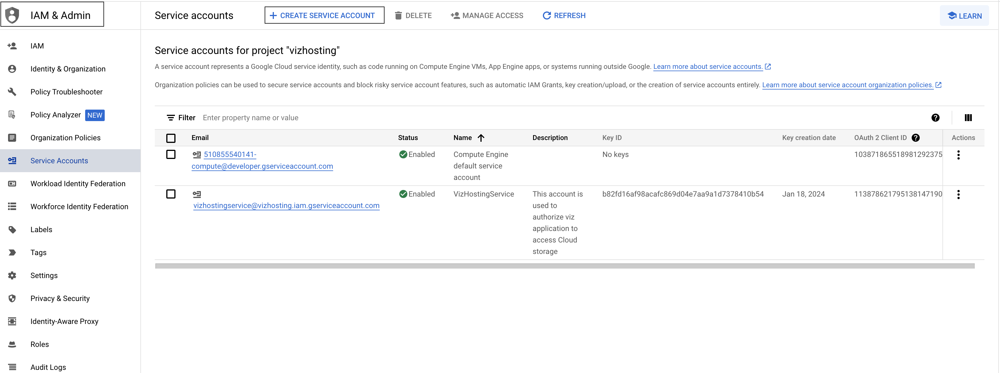


You must assign `Storage Object Creator` and `Storage Object User` roles

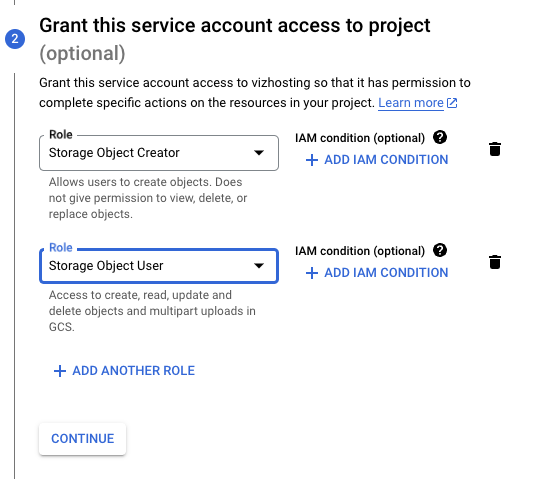

You can ignore granting users access to this service account unless required by your project and click on Done

Once the Service Account is created, you need to generate a Service Account Key as shown below

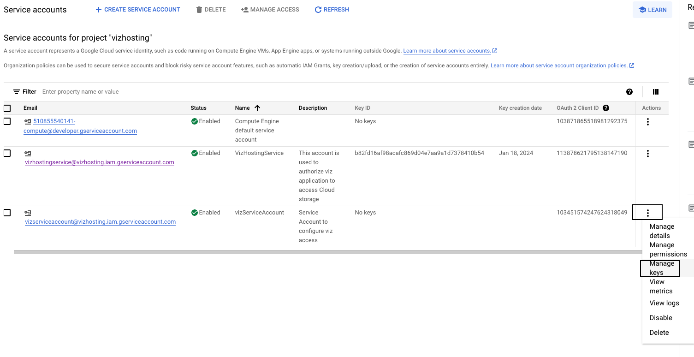

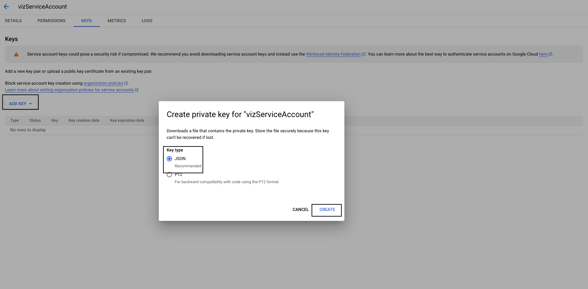

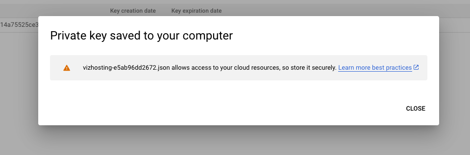


Once that's completed, you'll need to set your generated Service Account Key file absolute path as environment variable in your terminal window, as shown below:

```bash
export GOOGLE_APPLICATION_CREDENTIALS="absolute-path-to-downloaded-service-account-key-file"
```

For more information, see the official Google documentation about [how to work with environmental credentials](https://cloud.google.com/composer/docs/how-to/managing/environment-variables).


#### Permissions and access control

All permissions and access control are controlled by Google. It's up to you, the user, if you want to allow anyone to see your project or limit access to certain IP addresses, users, or groups.

You can control who can view your visualisation using [IAM permissions and ACLs](https://cloud.google.com/storage/docs/access-control#using_permissions_with_acls). See the official Google documentation for more information.

#### Billing

You pay for storing objects on your Google Cloud Storage. The amount you pay depends on the amount of data stored, data processing and network usage. Additionally you may be charged for using Cloud Load Balancing.

See the official [Google Cloud Storage Billing](https://cloud.google.com/storage/pricing) and [Google Cloud Load Balancing Billing](https://cloud.google.com/vpc/network-pricing#lb) for more information.

### Publish and share the project

Once the Cloud Provider specific setup is completed, you're now ready to publish and share your Kedro-Viz project. Start Kedro-Viz by running the following command in your terminal:

```bash
kedro viz run
```

Click the **Publish and share** icon in the lower-left of the application. You will see a modal dialog to select your relevant AWS Bucket Region and enter your Bucket Name.

```{note}
From Kedro-Viz version 7.2.0, you will see a modal dialog to select your hosting platform, input your bucket name and endpoint link.

* **aws -** The endpoint link can be found under S3 bucket -> properties -> Static website hosting -> Bucket website endpoint.
* **azure -** The endpoint link can be found under Storage account -> Capabilities -> Static website -> Primary endpoint.
* **gcp -** The endpoint link can be found under your Application Load Balancer -> Frontend -> IP:Port if you are using `HTTP`. 
If you have set up SSL certificate and serve your site using `HTTPS` then provide your root domain.
```

Once those details are complete, click **Publish**. A hosted, shareable URL will be returned to you after the process completes.

Here's an example of the flow:


```{note}
We will be updating the user flow doc for v7.2.0 soon...
```

From Kedro-Viz version 7.0.0, you can now publish and share your Kedro-Viz project from the command line. Use the following command from the root folder of your Kedro project

```bash
kedro viz deploy --region=[aws-bucket-region] --bucket-name=[aws-bucket-name]
```

```{important}
From Kedro-Viz version 7.2.0, the `kedro viz deploy` command takes platform, endpoint and bucket name as its options.
```

From Kedro-Viz version 7.2.0, use the following command from the root folder of your Kedro project

```bash
kedro viz deploy --platform=[cloud-provider] --endpoint=[static-website-link] --bucket-name=[bucket-name]
```

## Platform-agnostic sharing with Kedro-Viz 

In Kedro-Viz version 7.1.0, we introduced the `kedro viz build` command that enables you to publish and share Kedro-Viz to any static website hosting platform. Running this command from the command line interface (CLI) creates a `build` folder within the Kedro project. The build folder contains a static Kedro-Viz app package, which can be used as a source to publish on any static website hosting platform.

### Static website hosting platforms such as GitHub Pages

Follow the steps [listed in the GitHub pages documentation](https://docs.github.com/en/pages/quickstart) to create a Git repository that supports GitHub Pages. On completion, push the contents of the `build` folder to this new repository. Your site will be available at the following URL: `http://<username>.github.io`

### Cloud providers such as AWS, Azure, and GCP

After creating a bucket and configuring it for static website hosting, copy the contents of the `build` folder to the bucket manually. You can then access the bucket via its endpoint.

For AWS, we also offer [automated deployment as described above](#publish-and-share-kedro-viz-automatically).

```{note}
From Kedro-Viz version 7.2.0, we offer automated deployments on Azure and GCP.
```