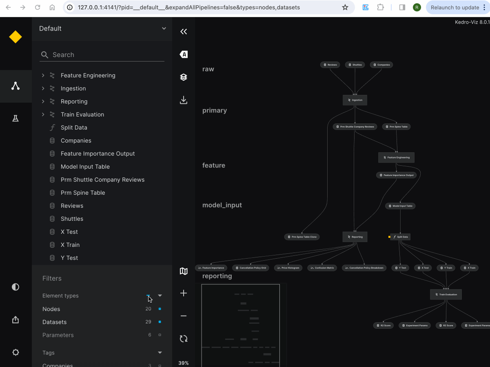

# Publish and share Kedro-Viz

The publish and share feature on Kedro-Viz enables seamless sharing of pipeline visualizations on any static website hosting platform. There are two methods:

1. **Platform-agnostic sharing with Kedro-Viz:** Use the `kedro viz build` command to publish Kedro-Viz on platforms like GitHub pages, sharing the generated URL. This is described in [Platform-agnostic sharing with Kedro-Viz](./platform_agnostic_sharing_with_kedro_viz)

2. **Publish and share Kedro-Viz automatically:** Use the `kedro viz deploy` command to automatically share Kedro-Viz on AWS, Azure, or GCP.  See detailed guides below:
* [Publish and share on AWS](./publish_and_share_kedro_viz_on_aws)
* [Publish and share on Azure](./publish_and_share_kedro_viz_on_azure)
* [Publish and share on GCP](./publish_and_share_kedro_viz_on_gcp)


## Filtering and sharing Kedro-Viz pipelines 

Kedro-Viz allows you to focus on specific aspects of your data pipeline by filtering the visualization. Once filtered, you can easily share the view with others by sharing the URL.

As you apply filters, the URL in your browser automatically updates to reflect the current state of your filtered pipeline. When you select the desired filters or options from the user interface, such as filtering by type, tags, or focus mode, the resulting URL can be shared with others. This provides them with access to the same filtered view of your pipeline.




```{toctree}
:maxdepth: 1
:hidden:
platform_agnostic_sharing_with_kedro_viz
publish_and_share_kedro_viz_on_aws
publish_and_share_kedro_viz_on_azure
publish_and_share_kedro_viz_on_gcp
```

