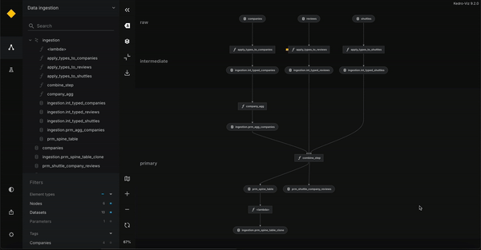
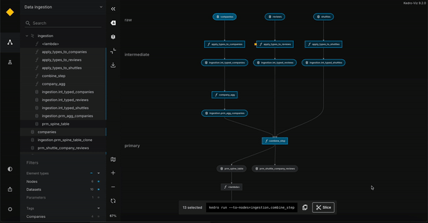

# Slice a pipeline

Slicing a pipeline in Kedro refers to creating a subset of a pipeline's nodes, which can help in focusing on specific parts of the pipeline. There are two primary ways to achieve this:

1. **Programmatically with the Kedro CLI.** This method is suitable for those comfortable with command-line tools. Detailed steps on how to achieve this are available in the kedro documentation: [Slice a Pipeline](https://docs.kedro.org/en/stable/nodes_and_pipelines/slice_a_pipeline.html).

2. **Visually through Kedro-Viz:** This approach allows you to visually select and slice pipeline nodes, which then generates a run command for executing the slice within your Kedro project.

## Benefits of Kedro-Viz slicing

- **Visual Representation:** View the relationships between nodes and identify which ones are part of your slice.
- **Immediate Command Generation:** Get a ready-to-use CLI command for executing the sliced pipeline.
- **Interactive Control:** Visually select and reset slices with a couple of clicks.

## Steps to slice in Kedro-Viz

Kedro-Viz offers a user-friendly visual interface for slicing pipelines. Follow these steps to use the slicing feature:

1. **Select elements in the flowchart:** In Kedro-Viz, select two elements to set the boundaries for your slice:
   - Click on the first node you want to include.
   - Hold the Shift key and select the second node.
   

2. **Highlighted selection:** The flowchart will highlight all nodes between the selected elements, and the corresponding nodes in the list on the left will also be highlighted.

3. **View the run command:** After selecting the nodes, Kedro-Viz generates a CLI command for the sliced pipeline. You can copy this command and use it directly in your Kedro project to run the slice.

4. **Slice the pipeline:** When you're ready, click the "Slice" button. This opens a new view where you can directly interact with the sliced pipeline.

5. **Reset:** To discard your selection and return to the full pipeline view, click the "Reset" button. This will clear the slice and restore the default view.

