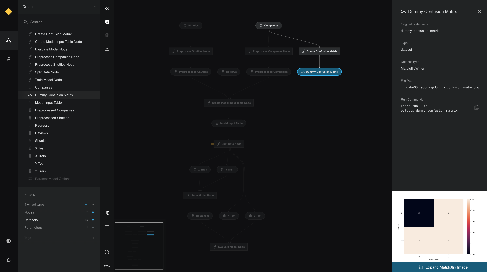
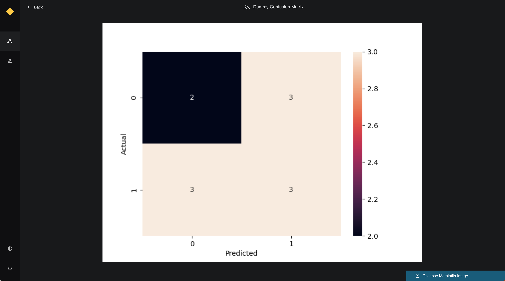

# Visualise charts in Kedro-Viz with Matplotlib

This page describes how to output interactive visualisations of a Kedro project with Kedro-Viz, which supports integration with [Matplotlib](https://matplotlib.org/). You can view Matplotlib charts in Kedro-Viz when you use the MatplotLibWriter dataset.


```{note}
The MatplotlibWriter dataset converts Matplotlib objects to image files. This means that Matplotlib charts within Kedro-Viz are static and not interactive, unlike the [Plotly charts seen separately](./visualise_charts_with_plotly.md).
```

We use the [spaceflights tutorial](https://docs.kedro.org/en/stable/tutorial/spaceflights_tutorial.html) and add a reporting pipeline. Even if you have not yet worked through the tutorial, you can still follow this example; you'll need to use the [Kedro starter for the spaceflights tutorial](https://github.com/kedro-org/kedro-starters/tree/main/spaceflights) to generate a copy of the project with working code in place.

If you haven't installed Kedro [follow the documentation to get set up](https://docs.kedro.org/en/stable/get_started/install.html).

Then, in your terminal window, navigate to the folder you want to store the project.

Generate a copy of the spaceflights tutorial project with all the code in place by using the [Kedro starter for the spaceflights tutorial](https://github.com/kedro-org/kedro-starters/tree/main/spaceflights):

```bash
kedro new --starter=spaceflights
```

When prompted for a project name, you can enter anything, but we will assume `Spaceflights` throughout.

When your project is ready, navigate to the root directory of the project.


## Update the dependencies

You must update the `src/requirements.txt` file in the Kedro project by adding the following dataset to enable Matplotlib for the project:

```bash
kedro-datasets[matplotlib.MatplotlibWriter]~=1.1
seaborn~=0.12.1
```

## Configure the Data Catalog
You must also specify the output type in the `catalog.yml` file for the Data Catalog:

```yaml
dummy_confusion_matrix:
  type: matplotlib.MatplotlibWriter
  filepath: data/08_reporting/dummy_confusion_matrix.png
  versioned: true
```

## Add another node
Add the following to `src/spaceflights/pipelines/reporting/nodes.py`:

```python
import matplotlib.pyplot as plt
import seaborn as sn

...


def create_confusion_matrix(companies: pd.DataFrame):
    actuals = [0, 1, 0, 0, 1, 1, 1, 0, 1, 0, 1]
    predicted = [1, 1, 0, 1, 0, 1, 0, 0, 0, 1, 1]
    data = {"y_Actual": actuals, "y_Predicted": predicted}
    df = pd.DataFrame(data, columns=["y_Actual", "y_Predicted"])
    confusion_matrix = pd.crosstab(
        df["y_Actual"], df["y_Predicted"], rownames=["Actual"], colnames=["Predicted"]
    )
    sn.heatmap(confusion_matrix, annot=True)
    return plt
```

## Update the pipeline

Update `src/spaceflights/pipelines/reporting/pipeline.py` to add the following to `create_pipeline`:

```python
from .nodes import create_confusion_matrix

...


def create_pipeline(**kwargs) -> Pipeline:
    """This is a simple pipeline which generates a plot"""
    return pipeline(
        [
            node(
                func=create_confusion_matrix,
                inputs="companies",
                outputs="dummy_confusion_matrix",
            ),
        ]
    )
```

## Run the pipeline

Run the pipelines with `kedro run` and then visualise the result with `kedro viz`.

Click to see a small preview of the Matplotlib image in the metadata panel.



View the larger visualisation of the chart by clicking the 'Expand Matplotlib Image' button on the bottom of the metadata panel.


