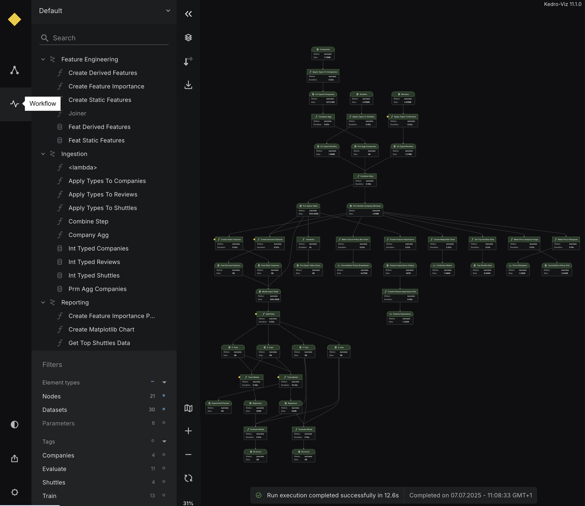

# Visualise pipeline execution with the Workflow view in Kedro-Viz

Available from Kedro-Viz 12.0.0 onward, the Workflow view helps you visualise and debug your most recent kedro run. You’ll be able to see which nodes succeeded, failed, or were skipped - all in one place.

## Overview

The Workflow view gives you a visual summary of your **most recent pipeline run**, helping you understand what happened during execution and where things might have gone wrong.

It captures and displays three key aspects of your workflow:

1. **Pipeline execution**: See the information of your last run, including the start/end time and total duration.
2. **Node execution**: View individual node statuses — including success, failure, or skipped — along with how long each node took to run.
3. **Dataset operations**: Inspect what datasets were loaded or saved, along with their sizes.

If a node fails, the Workflow view will also surface the traceback error, so you can debug issues directly without digging through logs.

This data is automatically collected when you run your pipeline with Kedro and displayed as an interactive visualisation in Kedro-Viz.

## Get started

### Prerequisites

- Kedro-Viz must be installed in your environment (Kedro-Viz > 12.0.0)
- Your project must be a valid Kedro project (Kedro > 1.0.0)

### Create a new project

This section assumes you are familiar with the basic Kedro concepts described in the [spaceflights tutorial](https://docs.kedro.org/en/stable/tutorial/spaceflights_tutorial.html). If you have not yet worked through the tutorial, you can still follow this example.

In your terminal window, navigate to the folder you want to store the project. Generate the spaceflights tutorial project with all the code in place by using the Kedro starter for the spaceflights tutorial:

```bash
kedro new --starter=spaceflights-pandas
```

When prompted for a project name, you can enter anything, but we will assume `Spaceflights` throughout.

When your project is ready, navigate to the root directory of the project and install the dependencies for the project, which include Kedro-Viz:

```bash
pip install -r requirements.txt
```

### Run a pipeline

To see your pipeline execution in the Workflow view, execute your pipeline using the standard Kedro command:

```bash
kedro run
```

!!! info
    - The Workflow view is available for full pipeline runs using `kedro run`. Partial pipeline runs (using `--from-nodes`, `--to-nodes`, `--tags`, `--pipeline`, and more) are not supported.
    - SequentialRunner is supported. ParallelRunner and ThreadRunner are not supported.

This will:

- Execute your pipeline
- Automatically collect execution statistics and timing information
- Generate workflow data in the `.viz/kedro_pipeline_events.json` file

Once the run is complete, you can visualise the results:

```bash
kedro viz run
```

Navigate to the **Workflow** view to see your pipeline execution information.



## Workflow view scenarios

The following examples show how the Workflow view appears in different pipeline execution scenarios:

### Successful pipeline execution


When all nodes execute without errors, you'll see:

- All nodes display green indicators for successful execution
- A success notification shows the total runtime
- Each node displays its execution duration
- Dataset sizes appear on nodes where available  

### Node execution failure


When a node fails during execution, you'll see:

- The failed node displays a red indicator
- An error notification showing which node failed
- Clicking the node reveals the full traceback error for debugging
- Clear visual display of where the pipeline stopped

### Dataset missing error


When a required dataset is missing, you'll see:

- The pipeline fails early with clear error message
- The missing dataset is highlighted in the visualisation
- Helpful error messages to guide you towards resolution

