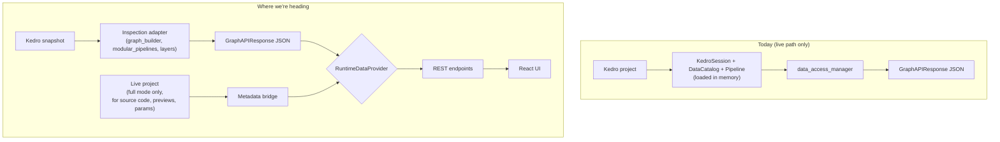

# Inspection Adapter — Sub-tickets

This folder breaks the inspection-adapter work on issue #2265 into a small set of focused sub-tickets. Each numbered file is one ticket, structured the same way so reviewers always know where to look. The repo-root files `INSPECTION_ADAPTER_PLAN.md` and `progress.md` remain the source of truth for the implementation; this folder is the GitHub-shaped view.

## What we're building

Kedro-Viz today loads your whole Kedro project — catalog, pipelines, datasets, all in memory — just to draw the diagram. Kedro 1.4.0 ships a lightweight read-only **snapshot** of a project. We're adding a thin **adapter** that builds Kedro-Viz's existing diagram JSON from that snapshot, so most of the heavy load becomes optional. The React frontend doesn't change.

## Architecture

- **Full mode** still loads the live project, but only for live-only features (source code, previews, parameter values, stats) — the diagram comes from the snapshot, with IDs bridged.
- **Lite mode** skips the live load entirely; the detail panel degrades to what the snapshot can offer.

## The seven sub-tickets

| # | Title                                                          | Status |
|---|----------------------------------------------------------------|--------|
| 1 | Foundations — snapshot loader, ID scheme, parity harness       | Done   |
| 2 | Snapshot → main graph (nodes, edges, tags, pipelines)          | Done   |
| 3 | Modular pipelines from the snapshot                            | Done   |
| 4 | Layers                                                         | Done   |
| 5 | Runtime integration — provider seam and experimental flag      | Done   |
| 6 | ID lockstep — run-status hook + metadata bridge + export       | Done   |
| 7 | Lite mode + flip the default                                   | Done   |

All seven sub-tickets are implemented in this branch / workstream (not yet merged to `main`). Two follow-ups remain outside the seven tickets: frontend jest-snapshot regeneration and the lite-mode degradation UX — both owed to the frontend team.

Removing the old live-graph traversal is a separate, gated follow-up that fires after parity is signed off and the Kedro floor is raised — out of scope of these seven tickets.

## Decisions already in

- Minimum Kedro version is **1.4.0** (the first release with the inspection API).
- Adapter lives under `package/kedro_viz/integrations/kedro/inspection/`.
- New node IDs are generated viz-side from `name + inputs + outputs`. **This is a breaking release** — old `?selected=<id>` deep links and previously exported sites go stale.
- Node metadata stays on the live path until lite mode actually needs the snapshot version (ticket 7).
- Graph, node-metadata and run-status reads plus static export move through one `RuntimeDataProvider` — no scattered `if flag else live` checks across routes.
- Rollout: shipped initially behind an experimental env var (default OFF) so the path could be tested without affecting users; ticket 7 flipped the default to ON once parity was signed off. `KEDRO_VIZ_INSPECTION_ADAPTER=0` opts back into the legacy path as a temporary safety net until the legacy code is removed in a follow-up.
- When `kedro viz run --params x=y` is used, adapter mode automatically falls back to the live path and logs why (snapshot API doesn't accept runtime params).

## Trade-offs we knowingly took

- One-time ID break. The alternative was asking Kedro to bake a viz-specific ID into the inspection API, which it shouldn't own.
- Layers cause a second read of the catalog config — the snapshot does not expose the viz metadata, so the adapter reads it itself. Acceptable.
- The adapter emits the API response shape directly. That made parity testing fast but means our integration point is a new provider seam, not `data_access_manager`.

## How to use this folder

Each sub-ticket file is short on purpose — read it in two minutes, file as is. The **Status** line at the top tells you whether the ticket documents work already implemented in this branch or work still ahead.
