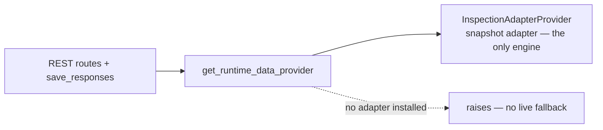

**Parent issue:** #2265
**Depends on:** 01, 02, 03, 04

> **Rewritten (D21).** This ticket was originally a *two-engine* design — an adapter plus a retained `LiveDataProvider`, selected per request, with `--params` served by the live path (D14/D17/D18). That design was reversed (D21). In the version below the adapter becomes the **only** graph engine and the live graph-building stack is **deleted**.

## Summary

Make the snapshot adapter the single runtime engine and remove the old live graph-building stack. The graph read endpoints and the static-export path go through one `RuntimeDataProvider`; `get_runtime_data_provider()` returns the installed `InspectionAdapterProvider`, and raises if none is installed — there is no live fallback. Route `kedro viz run --params=...` through the adapter (parameter values resolved from the config loader), then delete `LiveDataProvider`, the `data_access` graph traversal + repositories, and the module-level live response builders.

## Why this exists

The adapter reproduces everything the live path produced for the graph (verified against the captured baseline), so a second engine is dead weight. One seam means one place that answers a request; deleting the live stack removes ~1,200–1,500 lines of bespoke graph-building code and the silent "is it adapter or live?" ambiguity.

## The seam (after the switch)



## Decisions locked in

- **D11/D12** — one provider abstraction; no scattered `if adapter else live` conditionals across routes.
- **D21 (supersedes D14/D17/D18)** — the live graph engine is **deleted**; the adapter is the only engine. `--params` runs through the adapter: topology is param-invariant on `kedro>=1.4`, and parameter *values* are resolved from the config loader and overlaid (the snapshot stores only parameter key names, not values). An adapter build failure raises (fail fast) instead of silently degrading.
- The detail-panel metadata bridge (full mode) is kept and built in #2660; only the *graph-building* live stack is removed here.

## What's deleted

- `LiveDataProvider` (`api/data_provider.py`); the factory returns the adapter or raises.
- `data_access/managers.py` graph traversal — the `add_pipelines` path, edges, node dependencies, registered-pipeline lists, and modular-tree expansion (the file is slimmed to the metadata-bridge builders).
- `data_access/repositories/`: `RegisteredPipelinesRepository` and the edges repository.
- Module-level live response builders: `get_pipeline_response` / `get_kedro_project_json_data` (`responses/pipelines.py`) and `get_node_metadata_response` (`responses/nodes.py`).

## What's kept

- The slim metadata-bridge builders in `data_access/managers.py` (`add_metadata_nodes` + the node/dataset factories) that back `/api/nodes/{id}` in full mode (see #2660), and `sort_layers`.
- All API response models (the wire format the frontend depends on).

## Files

```
package/kedro_viz/api/
├── data_provider.py                 (RuntimeDataProvider Protocol; adapter-only factory; LiveDataProvider removed)
└── inspection_adapter_provider.py   (graph read methods; metadata + export extended in #2660)

package/kedro_viz/api/rest/router.py  (/api/main + /api/pipelines/{id} go through the seam)
package/kedro_viz/server.py           (startup wiring: build + install the adapter; --params resolved via the config loader; build-failure raises)
package/kedro_viz/integrations/kedro/inspection/snapshot_source.py  (load_parameters + runtime-params overlay)

deletions / slimming:
package/kedro_viz/data_access/managers.py            (graph traversal removed; metadata-bridge builders kept)
package/kedro_viz/data_access/repositories/          (registered_pipelines + edges repository removed)
package/kedro_viz/api/rest/responses/pipelines.py    (get_pipeline_response / get_kedro_project_json_data removed; models kept)
package/kedro_viz/api/rest/responses/nodes.py        (get_node_metadata_response removed; models kept)

package/tests/test_api/test_data_provider.py                       (adapter-only factory)
package/tests/test_inspection_adapter/test_router_flag_on.py
package/tests/test_inspection_adapter/test_inspection_adapter_provider.py
package/tests/test_inspection_adapter/test_runtime_params.py        (--params via the adapter)
```

## Acceptance

- Default `kedro viz run`: `/api/main` and `/api/pipelines/{id}` match the captured baseline structurally for every demo pipeline, served only by the adapter.
- `kedro viz run --params=...`: the override is reflected on task nodes in `/api/main` and in `/api/nodes/{id}`, served by the adapter (no live path).
- `kedro viz run --pipeline X` is honoured; `/api/pipelines/<bad_id>` returns 404.
- `get_runtime_data_provider()` raises a clear error when no adapter is installed (no silent empty graph).
- The live graph-building stack is gone and the full test suite is green.
