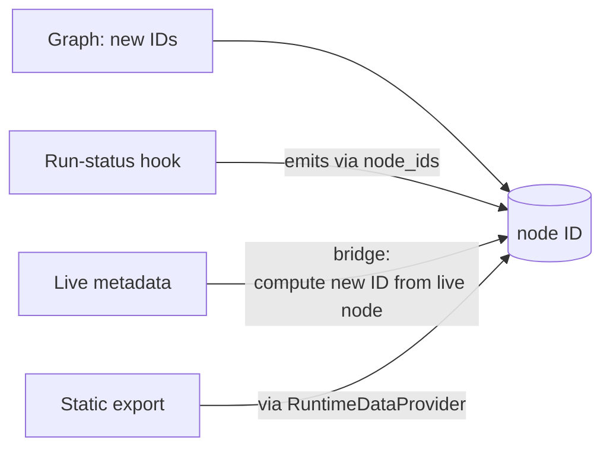

**Parent issue:** #2265
**Depends on:** #2659

## Summary

Once the diagram uses the new node IDs, the detail panel and run-status must use the same IDs or they stop matching it. This ticket moves them across together: switch the run-status hook to the shared `node_ids` module, build a bridge that resolves new IDs to live `KedroNode` / `AbstractDataset` objects for the detail panel, and re-route static export through the provider.

> **Update (D17):** the original text referred to this work landing "behind the flag" / "flag-ON." The experimental env-var flag was later removed (D17); the adapter is the default. The IDs, the bridge, the hook switch, and the export path are all live unconditionally — there is no flag.

> **Update (D21 — live backend removed):** the live graph engine has since been deleted, so the bridge is now the *only* full-mode metadata path. `/api/nodes/{id}` is served from the live objects via the bridge in full mode and from the snapshot lookup in lite mode. The hook switch and export changes below are unchanged.

## Why this exists

The node ID is the *join key* across the diagram, the detail panel, and run-status. Changing it in one place without the others would silently break filters, click-to-inspect, and run progress.

## The bridge

## Decisions locked in

- **D10/D13** — in full mode the detail panel is served from the live objects via the bridge; the snapshot-only (lite) detail panel is built in #2661.
- The bridge works by computing the same `task_node_id(...)` / `dataset_node_id(...)` on each live object, giving a stable `new_id → live object` map. (Hardened later: membership is keyed by task identity, and transcoded datasets resolve from the stripped catalog name.)

## Trade-offs taken

- The hook switches in lockstep with the adapter graph IDs so the live graph and run-status keep correlating in the running build.

## Files

- `package/kedro_viz/integrations/kedro/hooks_utils.py` — `hash_node()` routes through `node_ids.task_node_id()` / `dataset_node_id()`.
- `package/kedro_viz/integrations/kedro/run_hooks.py` — `create_dataset_event()` uses `node_ids.dataset_node_id()`.
- `package/kedro_viz/api/rest/responses/save_responses.py` — export reads go through the `RuntimeDataProvider`, not `data_access_manager` directly.
- `package/kedro_viz/api/inspection_adapter_provider.py` — the metadata bridge (`{new_id → live object}`) plus the export path. (Full mode also overlays bridge-only fields — resolved task `parameters` and `node_extras` — onto the graph response.)
- `package/tests/test_inspection_adapter/test_id_lockstep.py` — cross-endpoint ID equality test.

## Acceptance

- `test_id_lockstep.py` runs the demo end-to-end and asserts the same ID across `/api/main`, `/api/nodes/{id}`, and the run-status hook function.
- Static export produces the API file set the adapter is responsible for: `/api/main`, every `/api/pipelines/{id}`, every metadata-bearing `/api/nodes/{id}` (task, data, parameters), and `/api/run-status` — all carrying new-scheme IDs. Modular-pipeline node files are intentionally omitted (the live path writes empty `{}` for these; the frontend doesn't request them).
