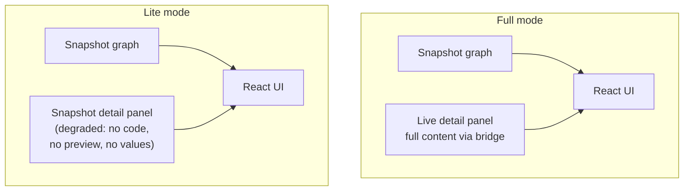

**Parent issue:** #2265
**Depends on:** #2659, #2660

## Summary

Add the lite (snapshot-only) mode — no live project load — and the thin snapshot-backed detail panel, with the frontend degradation behaviour (hide vs blank vs "unavailable") agreed with the frontend team. Ship release notes for the breaking ID change. (By this phase the inspection adapter is already the only graph engine — the live path was removed in #2659 — so there is no longer a "default" to flip.)

> **Update (D17/D18 → superseded by D21):** this ticket originally said "flip the experimental flag's default to ON" and edit `is_inspection_adapter_enabled()`. That flag was **removed** instead of flipped (D17): the adapter is installed by default with no env var, so RELEASE.md does **not** mention an opt-out. D18 then planned to *retain* the legacy path as the `--params` runtime-params path — but **D21 reversed that**: the legacy path has since been removed entirely, the adapter is the only engine, and `--params` runs through it (values resolved via the config loader).

## Why this exists

Lite mode is one of the main motivations of #2265 — cheap inspection without the heavy project load. This is also the moment the new IDs become public.

## Full vs lite

## Decisions locked in

- **D9 fully realised / D13** — lite mode skips the live load entirely; the snapshot-keyed `_snapshot_lookup` answers `/api/nodes/{id}` when the live bridge is empty.
- **D17 / D21** — there is no flag, and the adapter is the only engine (the live path was deleted in D21); `--params` runs through the adapter.
- The frontend degradation UX (hide vs blank vs "unavailable") is settled with the frontend team.

## Trade-offs taken (one-time)

- Old `?selected=<id>` deep links stop working — they reference the old ID scheme.
- Previously exported static sites are stale and need re-exporting.
- The repo's fixture set is regenerated in one mechanical change.

## Files (backend — as shipped)

- `package/kedro_viz/server.py` — `load_and_populate_data` short-circuits on `--lite`: skip `kedro_data_loader.load_data` + `populate_data`, build the adapter provider directly. (Under `--lite`, an adapter build failure now raises — there is no live fallback, per D21.)
- `package/kedro_viz/api/inspection_adapter_provider.py` — `_snapshot_lookup` so `/api/nodes/{id}` answers from snapshot data when the live bridge is empty (the lite detail panel).
- `RELEASE.md` — breaking-release callout for the new ID scheme (no opt-out env var; that was removed in D17).
- Tests: `package/tests/test_inspection_adapter/test_lite_metadata.py`, plus lite-startup coverage in `package/tests/test_server.py`.

## Frontend

- **Frontend jest-snapshot regeneration** — deferred to the frontend side (no backend fixture regeneration was needed; verified no backend test carries literal hash values).
- **Lite-mode degradation UX** — the frontend renders absent live-only keys (code, preview, parameter values, stats) as "unavailable"; the exact treatment is settled during this work. See `inspection-adapter-tickets/FRONTEND_HANDOFF.md`.

## Acceptance

- `kedro viz run --lite` starts the server without loading the live project and serves a coherent graph + a thin snapshot-backed detail panel.
- Full backend test suite green; no backend fixture regeneration required.
- RELEASE.md calls out the breaking ID change, the deep-link impact, and the re-export step.
- Frontend jest snapshots regenerated and lite-mode "unavailable" UX rendered — **pending the frontend team.**
