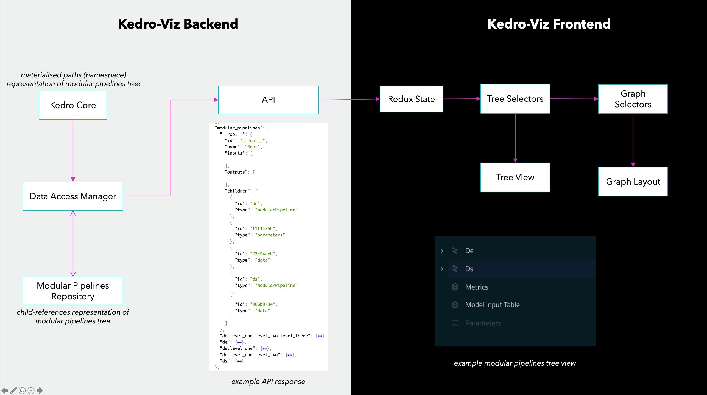

# [Technical Design] Expanse & Collapse of Modular Pipelines

## Introduction

This document describes the high-level technical design to enable the expanse and collapse of modular pipelines on Kedro-Viz:


## Background

On Kedro core, the modular pipelines tree is represented using a [materialized path](https://docs.mongodb.com/manual/tutorial/model-tree-structures-with-materialized-paths/) approach because of the following benefits:

* It is easy-to-use for Kedro users: They can declare their node 3 levels deep just by declaring `namespace=“one.two.three”`.
* It is efficient during Kedro runtime: at runtime a Kedro pipeline is just a flat set of nodes, so the materialized path
structure is superfluous and can be discarded without traversing cost.
* It also enables neat querying syntax for nodes in the tree, e.g. `pipeline.only_node_with_namespace(...)`

In other words, Kedro core optimizes for the leaves in the tree.

On the other hand, the folder-like display of modular pipelines is better served by a [child-references](https://docs.mongodb.com/manual/tutorial/model-tree-structures-with-child-references) structure:


```json
{
    "__root__": {
        "id": "__root__",
        "name": "Root",
        "inputs": [],
        "outputs": [],
        "children": [
            {"id": "d577578a", "type": "parameters"},
            {"id": "data_science", "type": "modularPipeline"},
            {"id": "f1f1425b", "type": "parameters"},
            {"id": "data_engineering", "type": "modularPipeline"},
        ],
    },
    "data_engineering": {
        "id": "data_engineering",
        "name": "Data Engineering",
        "inputs": ["d577578a"],
        "outputs": [],
        "children": [],
    },
    "data_science": {
        "id": "data_science",
        "name": "Data Science",
        "inputs": ["f1f1425b"],
        "outputs": [],
        "children": [],
    },
}
```

With this structure, both rendering and search can be implemented easily with simple recursion.

## Technical Design



The high-level technical design of this feature consists of:

1. Conversion logic between Kedro core's materialized path representation and Kedro-Viz's child-references representation
of the modular pipelines tree. This logic lives in the data access manager when adding modular pipelines to the repository
in the backend.
2. A new API response with the child-references representation of modular pipelines tree. The API response will also contain:
    - All modular pipelines as graph nodes and corresponding edges connecting them with other nodes.
    - All inputs and outputs for a modular pipeline. This will avoid having to deduce them for focused mode
    and also make sure we have a consistent inputs/outputs structure between collapsed view and focused view.
3. A re-implementation of the modular pipelines tree on the frontend, which renders the tree response verbatim without
having to reconstruct it from the graph on every render.
4. A new selectors structure that treats the modular pipelines tree on the sidebar as the source of truth for
what is visible on the graph.

## Circular dependencies

Even though on a node level a Kedro pipeline is strictly a DAG, on a modular pipelines level, there can be cycles.

### On a modular pipelines level

The first case of cycle is among modular pipelines themselves when collapsed. For example, consider the following pipeline:

```
++++++++++++++
+ QB.Product +
++++++++++++++
      |
      v
++++++++++++++
+ Contractor +
++++++++++++++
      |
      v
++++++++++++++
+ QB.Client  +
++++++++++++++
```

When both `QB.Product` and `QB.Client` are collapsed into `QB`, `QB` and `Contractor` will form a cyclic dependency.
We detect these cycles by checking every input into a modular pipeline to see if it is also a reachable descendant
of the same modular pipelines. If it is, we remove the edge from the input into the pipeline. In the example above,
following this logic, the collapsed pipelines will be:


```
++++++++++++++
+    QB      +
++++++++++++++
      |
      v
++++++++++++++
+ Contractor +
++++++++++++++
```

### On a layers level

Due to the fact that a modular pipeline might span multiple layers, there can be circular dependency on a layers level.
Consider the following scenario:

* Modular pipeline `A` & modular pipeline `C` are visualized on the Raw layer.
* Modular pipeline `B` is visualized on the Intermediate layer.
* The whole pipeline `A -> B -> C` will establish a `Raw -> Intermediate -> Raw` dependency among layer, which is circular.

To avoid this scenario, if we detect these cycles among layers, we will simply disable to layers visualization by 
returning an empty layers list and log a warning to `stdout`.
